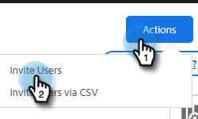

# Bjud in användare och administratörer {#invite-users-and-admins}

Det går snabbt och enkelt att lägga till användare eller administratörer!

## Bjud in användare {#invite-users}

1. Klicka på kugghjulsikonen och välj **Inställningar**.

   

1. Under Administratörsinställningar väljer du **Användarhantering**.

   

1. Klicka på **Åtgärder** och markera **Bjud in användare**.

   

   >[!NOTE]
   >
   >Du kan också välja **Bjud in användare via CSV** om du har alla i listan i ett kalkylblad.

1. Ange e-postadresserna till de personer du vill lägga till.

   

1. TILLVAL: Lägg till användare i alla team som de ska vara en del av. Om du hoppar över den här delen läggs alla nya medlemmar till i gruppen Alla.

   

   >[!NOTE]
   >
   >[Läs mer om Team](/help/marketo/product-docs/marketo-sales-insight/actions/admin/creating-a-team.md).

1. Markera den Marketo-arbetsyta som du vill lägga till nya användare i. Om du bara har en arbetsyta visas&quot;Standard&quot; som alternativ. Klicka **Bjud in**.

   

1. Klicka **OK**.

   

## Gör en användare till administratör {#make-a-user-an-admin}

>[!NOTE]
>
>**Administratörsbehörigheter krävs**

Följ de här stegen för att göra en befintlig användare till administratör.

1. Klicka på kugghjulsikonen och välj **Inställningar**.

   

1. Under Administratörsinställningar väljer du **Användarhantering**.

   

1. Hitta den användare du vill göra till administratör, klicka på listrutan Roll och välj **Administratör**.

   

Så enkelt är det!
