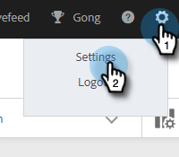
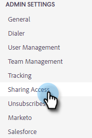

# Delningsinställningar {#sharing-settings}

Hantera mallarna bättre genom att begränsa vad användare kan dela och med vilka kategorier.

När ditt konto för Sales Insight Actions skapas aktiveras Delningsinställningar. Detta ger kontoadministratörer möjlighet att skapa och organisera dina mallkategorier innan de öppnar flödena och ger användarna möjlighet att dela innehåll i era teamkategorier.

När delningsinställningar är aktiverat kan bara administratörer dela i kategorier, såvida inte delningsbehörighet ges till ett team eller alla. Om Delningsinställningar är inaktiverat finns det inga begränsningar och alla användare kan dela i valfria mallkategorier.

## Konfigurera delningsinställningar {#configure-your-sharing-settings}

1. Klicka på kugghjulsikonen i [webbprogrammet](https://toutapp.com/login) och välj **[!UICONTROL Settings]**.

   

1. Välj [!UICONTROL Admin Settings] under **[!UICONTROL Sharing Access]**.

   

1. Kontrollera att **[!UICONTROL Sharing Settings]** är aktiverat. Detta innebär som standard att bara administratörer kan dela mallar i dina mallkategorier.

   

1. Välj den mallkategori som du vill konfigurera.

   

1. Klicka på **[!UICONTROL Add Teams for Access]**.

   

1. Välj de team som du vill lägga till.

   

   >[!NOTE]
   >
   >Om du inte ser något team måste du gå till Teamhantering och skapa ett team med användare.

1. Klicka på **[!UICONTROL Add Teams for Access]** om du vill spara.

   

1. Nu när ditt team har lagts till kan du välja att endast tillåta teamadministratörer att dela eller alla användare i det teamet. I det här exemplet ger vi alla användare på SDR-teamet delningsåtkomst.

   
