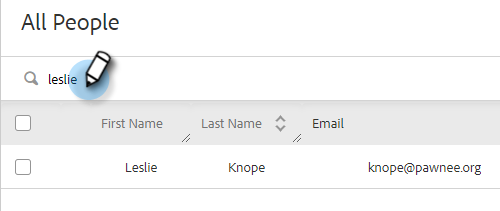
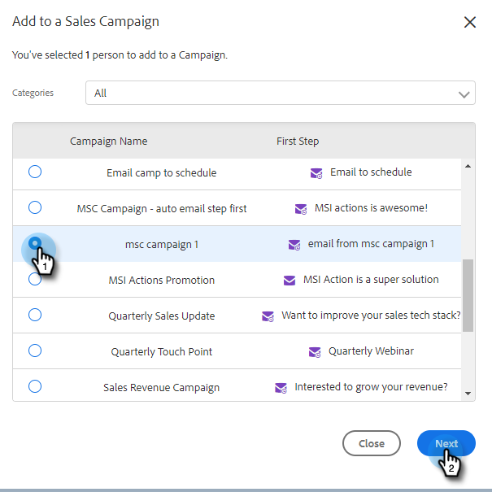

# Add to Marketing Campaign {#add-to-marketing-campaign}

>[!PREREQUISITES]
>
>

## Add Individuals to a Campaign {#add-individuals-to-a-campaign}

>[!NOTE]
>
>In order to add a person to a Marketo Campaign from Sales Connect, Sales Connect must have the person&#39;s Marketo lead ID.

1. ****

   

1. Find the contact(s) you want to add.

   

1. ****

   

1. STEP HERE

   

1. Since you&#39;re adding to a Marketing campaign, skip selecting a &quot;from&quot; address. You can however choose to add more contacts. If you choose to, click Individuals and type them in. ****

   

1. ****

PICC

1. Click the Workspaces drop-down and choose the workspace that contains the campaign you want the group added to.

PICC

>[!NOTE]
>
>If you don&#39;t see the workspace you want, make sure your Admin provisions it through your Marketo Team Access page.

1. ****

PICC

1. You&#39;re shown the contacts that qualify. ****

PICC

## Add a Group to a Campaign {#add-a-group-to-a-campaign}

1. ****

PICC

1. Under My Groups, select the group you wish to add to a campaign.

PICC

1. ****

PICC

1. Since you&#39;re adding to a Marketing campaign, skip selecting a &quot;from&quot; address. You can however choose to add more contacts. If you choose to, click Individuals and type them in. ****

PICC

1. ****

PICC

>[!NOTE]
>
>In order to add a person to a Marketo Campaign from Sales Connect, Sales Connect must have the person&#39;s Marketo lead ID.

1. Click the Workspaces drop-down and choose the workspace that contains the campaign you want the group added to.

PICC

>[!NOTE]
>
>If you don&#39;t see the workspace you want, make sure your Admin provisions it through your Marketo Team Access page.

1. ****

PICC

1. You&#39;re shown the contacts that qualify. ****

PICC
