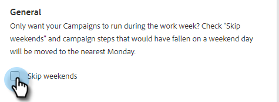
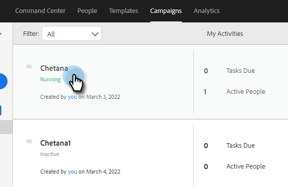
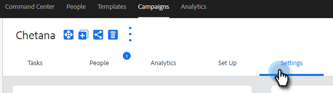

# Inställningar för försäljningskampanj {#sales-campaign-settings}

I avsnittet Inställningar för säljkampanj kan du konfigurera en specifik säljkampanj så att den fungerar på bästa sätt för teamets användningsfall för den försäljningskampanjen.

## Hoppa över helger {#skip-weekends}

Aktivera hopphelger så att alla steg som skulle ha inträffat på en veckodag (lördag eller söndag) flyttas till måndag.

>[!NOTE]
>
>När [!UICONTROL Skip Weekends] är aktiverat schemaläggs e-postmeddelanden utifrån en 5-dagars vecka. Det innebär att när ett steg är schemalagt ignoreras helger som dagar.

1. Klicka på **[!UICONTROL Campaigns]**.

   

1. Välj önskad säljkampanj.

   

1. Klicka på fliken **[!UICONTROL Settings]**.

   

1. Markera kryssrutan **[!UICONTROL Skip Weekends]**.

   

## Ta bort vid studs {#remove-on-bounce}

Om du använder e-postanslutning upptäcker vi studsar baserat på studsmeddelandet som skickas till användarens inkorg. Dessutom kan vi ta bort personer från säljkampanjer när ett studs.

1. Klicka på **[!UICONTROL Campaigns]**.

   

1. Välj önskad säljkampanj.

   

1. Klicka på fliken **[!UICONTROL Settings]**.

   

1. Markera kryssrutan **[!UICONTROL Remove on Bounce]**.

   

## Om ett svar inträffar {#if-a-reply-occurs}

Om svarsuppföljning är aktiverat för Gmail eller [!DNL Exchange] kan vi automatiskt avsluta din säljkampanj om en mottagare svarar på ditt e-postmeddelande.

1. Klicka på **[!UICONTROL Campaigns]**.

   

1. Välj önskad säljkampanj.

   

1. Klicka på fliken **[!UICONTROL Settings]**.

   

1. Gör dina val under **[!UICONTROL If a Reply Occurs]**.

   

>[!MORELIKETHIS]
>
>* [Skapa en säljkampanj](/help/marketo/product-docs/marketo-sales-insight/actions/campaigns/create-a-sales-campaign.md){target="_blank"}
>* [Om sändningsalternativ för försäljningskampanj för e-poststeg](/help/marketo/product-docs/marketo-sales-insight/actions/campaigns/understanding-sales-campaign-send-options-for-email-steps.md){target="_blank"}
>* [Stegtyper för säljkampanj och påminnelseaktiviteter](/help/marketo/product-docs/marketo-sales-insight/actions/campaigns/sales-campaign-step-types-and-reminder-tasks.md){target="_blank"}
