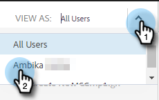
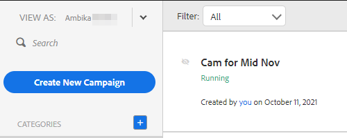

# Visa kampanjlistan som en annan användare {#view-campaigns-list-as-another-user}

Som administratör kan ni visa kampanjer som alla användare.

>[!NOTE]
>
>**Administratörsbehörigheter krävs**

1. Klicka på **[!UICONTROL Campaigns]** i webbprogrammet.

   

1. Klicka på listrutan **[!UICONTROL View As]** och välj önskad användare.

   

1. Du visar nu kampanjer som den valda användaren.

   

   >[!NOTE]
   >
   >Du kan också använda filter eller sökfunktionen tillsammans med [!UICONTROL View As] för att visa vad som är mest relevant för dig.
