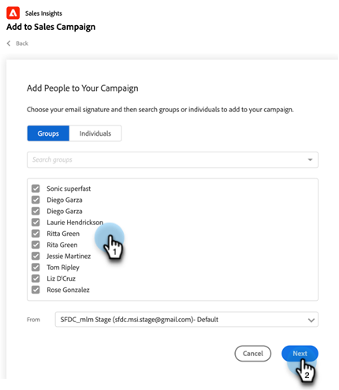

# Använda Lägg till i grupp i försäljningskampanj i Salesforce {#using-bulk-add-to-sales-campaign-in-salesforce}

Lär dig hur du kan lägga till flera i Sales Campaign i Salesforce för att skala din utgående kommunikation med hjälp av säljåtgärder.

>[!NOTE]
>
>Salesforce har en begränsning på 200 poster som kan väljas samtidigt.

>[!PREREQUISITES]
>
>Kontrollera att du har installerat det [senaste Sales Insight-paketet](/help/marketo/product-docs/marketo-sales-insight/msi-for-salesforce/upgrading/upgrading-your-msi-package.md){target="_blank"} till din Salesforce-instans och har konfigurerat [åtgärdsknapparna](/help/marketo/product-docs/marketo-sales-insight/actions/crm/salesforce-package-configuration/add-action-buttons-to-salesforce-list-view.md){target="_blank"} på din kontakt- och leadlista i Salesforce.

## Lägg till gruppvis i försäljningskampanj i Salesforce Lightning {#bulk-add-to-sales-campaign-in-salesforce-lightning}

1. I Salesforce går du till hemsidan Leads/Kontakter genom att klicka på fliken **Leads/Kontakter** .

   

1. I listrutan **Visa** väljer du önskad vy över de leads/kontakter som du vill skicka e-post till.

   >[!TIP]
   >
   >Du kan skapa en ny vy genom att klicka på kodikonen till höger och välja **Ny**. När du har gett vyn ett nytt namn och sparat det kan du klicka på filterikonen till höger för att filtrera ner till den önskade uppsättningen leads/kontakter som du vill skicka med e-post.

1. Välj önskad lead- eller kontaktlista och klicka på knappen **Lägg till i säljkampanj** .

   

1. Du kommer att navigeras till spärren Åtgärder för säljkampanj, med de valda mottagarna tillagda.

1. Gör de ändringar som behövs för att ta bort personer eller grupper och klicka sedan på **Nästa**.

   

1. Välj den försäljningskampanjkategori som du vill använda i listrutan Kategorier.

1. Välj den försäljningskampanj som du vill lägga till de valda personerna i och klicka på **Nästa**.

   

1. Du kan se olika alternativ beroende på vilket första steget i kampanjen är. Om ditt första steg är ett e-postmeddelande kan du redigera e-postmeddelandet för varje mottagare enligt nedan. Klicka på **Nästa** när detta är klart.

   

1. Om ditt första steg är ett e-postmeddelande och du har konfigurerat det så att du kan välja när kampanjen startar, kan du välja att **Starta nu** eller **Schemalägga en ny starttid**. Klicka på **Start** när detta är klart.

   

När du har klickat på Start visas en bekräftelseskärm där du ser hur många personer som har lagts till.

## Lägg till i säljkampanj gruppvis i Salesforce Classic {#bulk-add-to-sales-campaign-in-salesforce-classic}

1. Klicka på fliken **Leads/Kontakter** i Salesforce.

1. I listrutan Visa markerar du den vy med leads/kontakter som du vill skicka e-post till och klickar på **Gå**.

   

   >[!TIP]
   >
   >Du kan skapa en ny vy genom att klicka på Skapa ny vy och konfigurera de tillgängliga filtren för att begränsa listan över mottagare som du ska skicka e-post till.

1. Välj önskad lead- eller kontaktlista och klicka på knappen **Lägg till i säljkampanj** .

   

1. Du kommer att navigeras till spärren Åtgärder för säljkampanj med de personer som du har valt tillagda.

1. Gör de ändringar som behövs för att ta bort personer eller grupper och klicka sedan på **Nästa**.

   

1. Välj den försäljningskampanjkategori som du vill använda i listrutan **Kategorier**.

1. Välj den försäljningskampanj som du vill lägga till de valda personerna i och klicka på **Nästa**.

   

1. Du kan se olika alternativ beroende på vilket första steget i kampanjen är. Om ditt första steg är ett e-postmeddelande kan du redigera e-postmeddelandet för varje mottagare enligt nedan. Klicka på **Nästa** när detta är klart.

   

1. Om ditt första steg är ett e-postmeddelande och du har konfigurerat det så att du kan välja när kampanjen startar, kan du välja att **Starta nu** eller **Schemalägga en ny starttid**. Klicka på **Start** när detta är klart.

   

När du har klickat på Start visas en bekräftelseskärm där du ser hur många personer som har lagts till.

