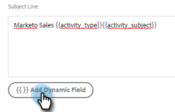

# Konfigurera anpassning av aktivitetsinformation för [!DNL Salesforce] {#configure-salesforce-activity-detail-customization}

>[!PREREQUISITES]
>
>* Salesforce och Sales Insight-åtgärderna [måste vara anslutna](/help/marketo/product-docs/marketo-sales-insight/actions/crm/salesforce-integration/connect-your-sales-insight-actions-account-to-salesforce.md)
>* E-postaktivitet för loggning via API [måste aktiveras](/help/marketo/product-docs/marketo-sales-insight/actions/crm/salesforce-integration/sync-sales-activities-to-salesforce.md)

Med anpassning av aktivitetsdetalj kan administratörer konfigurera den information som ska logga in i aktivitetsfältet [!DNL Salesforce] - ämne när en [!DNL Sales Insight Actions] aktivitet/påminnelseaktivitet synkroniseras till [!DNL Salesforce].

>[!NOTE]
>
>* Uppdateringar som görs i ämnesfältet i [!DNL Sales Insight Actions] för en påminnelseuppgift återspeglas i den motsvarande [!DNL Salesforce]-uppgiftens ämnesfält, om du använder det dynamiska `{{activity_subject}}`-fältet i anpassning av aktivitetsinformation.
>* Radbrytningar stöds inte vid loggning av information till ämnesfältet [!DNL Salesforce]. Eventuella radbrytningar i redigeraren för anpassning av aktivitetsinformation tas bort när en ny rubrik för en försäljningsaktivitet uppdateras.

<table>
 <tr>
  <td><strong>1</td>
  <td>Påminnelseuppgift för InMail</td>
 </tr>
 <tr>
  <td><strong>2</td>
  <td>E-postaktivitet</td>
 </tr>
 <tr>
  <td><strong>3</td>
  <td>Samtalsaktivitet</td>
 </tr>
</table>

Funktionen kan användas för att låsa upp följande fördelar:

* Genom att anpassa vilken information som visas i ämnesfältet är det enkelt att skanna aktivitetsinformationen för försäljning i Salesforce.
* Administratörer kan tagga ämnesfältet med en unik identifierare, t.ex.&quot;Mkto_sales&quot;, så att aktiviteter från Sales Insight Actions enkelt kan identifieras och skiljas från andra e-postaktiviteter, samtalsaktiviteter och uppgifter.
* Minska behovet av anpassade aktivitetsfält. Salesforce begränsar antalet anpassade aktivitetsfält, vilket kan begränsa vilka data som är tillgängliga för rapporter. Genom att använda dynamiska aktivitetsfält för att lägga till nyckeldata på ämnesraden kan du minska antalet anpassade aktivitetsfält som du behöver skapa i din Salesforce-instans.
* Ämnesfältet med aktiviteter och uppgifter följer ett konsekvent mönster som definieras av Sales Insight Actions Admin.

>[!NOTE]
>
>Om du loggar e-postsvar som aktiviteter till [!DNL Salesforce] kommer de inte att använda inställningarna för anpassning av aktivitetsinformation i [!DNL Salesforce] . I stället loggar de som&quot;Svara: E-postämne&quot;.

## Dynamiska aktivitetsfält som stöds {#activity-dynamic-fields-supported}

Dynamiska aktivitetsfält refererar till information om dina försäljningsaktiviteter för att fylla i data. I dag kan de användas med anpassning av aktivitetsinformation för [!DNL Salesforce].

>[!NOTE]
>
>Om det inte finns något värde för att fylla i det dynamiska fältet för en viss aktivitet/uppgift fylls inga data i för det dynamiska fältet när Salesforce Task - Subject Field uppdateras.

<table>
 <tr>
  <th>Fält</th>
  <th>Beskrivning</th>
 </tr>
 <tr>
  <td>{{activity_type}}</td>
  <td>Fyller i uppgiftstypen som Email, Call, InMail eller Custom.</td>
 </tr>
 <tr>
  <td>{{activity_subject}}</td>
  <td>
Fyller i föremålet för uppgiften.

      
Om det är ett e-postmeddelande fylls ämnesraden i i e-postmeddelandet.

      
Vid anrop, inMail eller anpassad fylls ett värde i om en påminnelseuppgift skapades med ett värde i aktivitetsnamnet/ämnesfältet.
</td>
 </tr>
 <tr>
  <td>{{sales_campaign_name}}</td>
  <td>Om aktiviteten initierades från en försäljningskampanj fylls försäljningskampanjens namn i.</td>
 </tr>
 <tr>
  <td>{{sales_campaign_day}}</td>
  <td>Om aktiviteten initierades från en försäljningskampanj fylls försäljningskampanjens dagnummer som aktiviteten inträffade på.</td>
 </tr>
 <tr>
  <td>{{sales_campaign_step}}</td>
  <td>Om aktiviteten initierades från en försäljningskampanj fylls stegnumret i under försäljningskampanjdagen som aktiviteten inträffade på.</td>
 </tr>
 <tr>
  <td>{{call_outcome}}</td>
  <td>Om aktiviteten är ett anrop och ett samtalsresultat väljs fylls värdet för anropsresultatet i.</td>
 </tr>
 <tr>
  <td>{{call_reason}}</td>
  <td>Om aktiviteten är ett samtal och en anropsorsak väljs fylls anropsorsaksvärdet i.</td>
 </tr>
</table>

## Konfigurerar anpassning av aktivitetsinformation för [!DNL Salesforce] {#configuring-salesforce-activity-detail-customization}

>[!NOTE]
>
>**Administratörsbehörighet krävs.**

När du konfigurerar din aktivitetsinformation bör du tänka på vilka data som är mest relevanta för försäljningen när du granskar aktivitetshistorik i [!DNL Salesforce].

1. Klicka på kugghjulsikonen och välj **[!UICONTROL Settings]**.

   

1. Klicka på **[!UICONTROL Salesforce]**.

   

1. Klicka på **[!UICONTROL Sync Settings]**.

   

1. I redigeraren Anpassa aktivitetsinformation lägger du till eventuell ledig text. Den text du lägger till är icke-dynamisk och förblir oförändrad för ämnesfältet för alla aktiviteter som synkroniseras med [!DNL Salesforce].

   

   >[!TIP]
   >
   >Även om det inte är nödvändigt kan det vara lättare för vissa personer att skilja mellan data när de fylls i i ett ämnesfält i [!DNL Salesforce] om du kapslar in text i raka parenteser. Exempel: `[Sales Insight Actions] - {{Activity_type}}`

1. Lägg till ytterligare dynamiska fält som du vill ha genom att klicka på knappen **[!UICONTROL Add Dynamic Field]**.

   

1. Markera önskade dynamiska fält.

   

1. Klicka på **[!UICONTROL Save]**.

   

>[!NOTE]
>
>[!DNL Salesforce] har en begränsning på 255 tecken. Om din aktivitetsinformation överstiger det, kommer den att trunkeras för att säkerställa att informationen lagras i ämnesfältet [!DNL Salesforce].

>[!MORELIKETHIS]
>
>* [Synkronisera försäljningsaktiviteter till Salesforce](/help/marketo/product-docs/marketo-sales-insight/actions/crm/salesforce-integration/sync-sales-activities-to-salesforce.md)
>* [Synkronisering av påminnelseaktivitet med Salesforce](/help/marketo/product-docs/marketo-sales-insight/actions/tasks/reminder-task-sync-with-salesforce.md)
