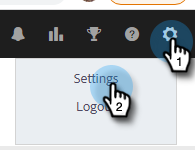

# Koppla ditt konto för Sales Insight Actions till Salesforce {#connect-your-sales-insight-actions-account-to-salesforce}

Följ de här enkla stegen för att ansluta Sales Insight Actions-kontot till Salesforce.

## Ansluta som administratör {#how-to-connect-as-an-admin}

1. Klicka på kugghjulsikonen och välj **Inställningar**.

   

1. Under Administratörsinställningar klickar du på **Salesforce**.

   

1. Klicka på fliken Anslutningar och anpassningar **Salesforce** sedan **Anslut**.

   

1. Klicka **OK**.

   

1. Om du redan är inloggad i Salesforce är du ansluten. Annars blir du ombedd att logga in.

## Ansluta som icke-administratör {#how-to-connect-as-a-non-admin}

1. Klicka på kugghjulsikonen och välj **Inställningar**.

   

1. Under Mitt konto väljer du **Salesforce**.

1. Klicka på fliken Anslutningar och anpassningar **Salesforce** sedan **Anslut**.

   

1. Klicka **OK**.

   

1. Om du redan är inloggad i Salesforce är du ansluten. Annars blir du ombedd att logga in.
