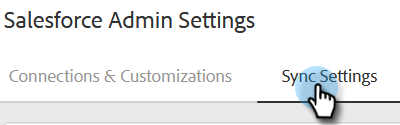
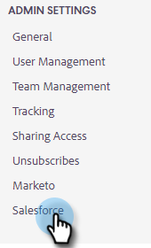

# Synkronisera försäljningsaktiviteter till Salesforce {#sync-sales-activities-to-salesforce}

Du kan konfigurera åtgärderna i Salesforce Sync Settings för att logga e-post och ringa aktiviteter till Salesforce. Detta ger bättre synlighet för team som arbetar med CRM och gör det möjligt för chefer att använda dessa aktiviteter för att skapa anpassade Salesforce-rapporter för att spåra teamets resultat.

## Logga e-postaktivitet till Salesforce via API {#logging-email-activity-to-salesforce-via-api}

Den här funktionen kräver att du finns i Enterprise/Unlimited Edition av Salesforce eller Professional Edition om du har köpt Integration via Web Services API.

>[!PREREQUISITES]
>
>Salesforce och Sales Insight Actions måste vara kopplade.

1. Klicka på kugghjulsikonen i Åtgärder för säljinsikter och välj **Inställningar**.

   

1. Klicka på **Salesforce** under Administrationsinställningar (eller Mitt konto om du inte är administratör).

   

1. Klicka på fliken **Synkronisera inställningar**.

   

1. Klicka på pilen bredvid Logga e-postaktivitet till Salesforce.

   

1. Klicka på fliken **Salesforce API**. På det här kortet kan du ange inställningar för att logga information till Salesforce. Klicka på **Spara** när du är klar.

   

## Logga e-postaktivitet till Salesforce via e-post till Salesforce (BCC) {#logging-email-activity-to-salesforce-via-email-to-salesforce-bcc}

När du har aktiverat&quot;E-post till Salesforce (BCC)&quot; får du en kopia av dina säljmeddelanden och dina e-postmeddelanden loggas som aktiviteter på affärsmöjligheter, leads och kontakter.

>[!PREREQUISITES]
>
>Salesforce och Sales Insight Actions måste vara kopplade.

**Logga dina e-postmeddelanden i Salesforce via e-post (BCC)**

1. Klicka på kugghjulsikonen i Marketo Sales och välj **Settings**.

   

1. Klicka på **Salesforce** under Administrationsinställningar (eller Mitt konto om du inte är administratör).

   

1. Klicka på fliken **Synkronisera inställningar**.

   

1. Klicka på fliken **E-post till Salesforce (BCC)** och klicka på **Aktivera**.

   

Om din e-postadress till Salesforce av någon anledning inte visas ska du följa de här stegen för att aktivera funktionen Hemlig kopia i ditt Salesforce-konto:

1. Logga in på din Salesforce-instans.
1. Hitta ditt användarnamn i det övre högra hörnet och välj listrutan.
1. Välj **Mina inställningar**.
1. Välj **E-post**.
1. Välj **Min e-post till Salesforce**.
1. På den här sidan visas ett fält med namnet&quot;E-post till Salesforce-adress&quot;. Om inget fylls i bredvid det bläddrar du nedåt till&quot;Mina godkända e-postadresser&quot;.
1. Ange den eller de e-postadresser som du vill ska kopieras.
1. Klicka på **Spara ändringar**.

**Kan inte hitta min e-post till Salesforce i Mina inställningar**

Om du inte ser Min e-post till Salesforce under dina inställningar har administratören kanske inte aktiverat den. Det här kan hända om ditt team inte har använt Salesforce tidigare eller om ditt team aldrig har använt den hemboksadress som Salesforce tillhandahåller.

>[!NOTE]
>
>Du måste ha administratörsbehörighet för att kunna konfigurera detta.

1. Klicka på **Konfigurera**.
1. Klicka på **E-postadministration**.
1. Klicka på **Skicka e-post till Salesforce**.
1. Klicka på **Redigera**.
1. Markera rutan bredvid&quot;Aktiv&quot;.
1. Klicka på **Spara**.

## Synkronisera uppgifter/påminnelser om försäljningsåtgärder till Salesforce-uppgifter {#sync-sales-insight-actions-tasks-reminders-to-salesforce-tasks}

1. Klicka på kugghjulsikonen i Åtgärder för säljinsikter och välj **Inställningar**.

   

1. Klicka på **Salesforce** under Administrationsinställningar (eller Mitt konto om du inte är administratör).

   

1. Klicka på fliken **Synkronisera inställningar**.

   

1. Klicka på pilen bredvid Synkronisera Marketo säljuppgifter/påminnelser till Salesforce-uppgifter.

   

1. Välj önskat alternativ (&quot;Synkronisera inte till Salesforce-uppgifter&quot; är markerat som standard).

   

## Synkronisera uppgifter för Sales Insight-åtgärder med Salesforce för första gången {#syncing-sales-insight-ations-tasks-with-salesforce-for-the-first-time}

När du först aktiverar synkroniseringen mellan Sales Insight Actions och Salesforce tasks importerar vi dina Salesforce-uppgifter. Vi kommer inte att föra över några uppgifter du har i Sales Insight Actions till Salesforce. För att minska trassel och dubbletter är de enda uppgifter som synkroniseras från Sales Insight Actions till Salesforce uppgifter som skapas när du har synkroniserat Sales Insight Actions med SFDC.

Så här synkroniserar du Sales Insight Actions och SFDC tasks:

* När du klickar på Spara för uppgifter synkroniseras de om. Det här kommer att ta en stund från början.

* Påminnelser som har uppdaterats eller skapats de senaste 24 timmarna hämtas in från SFDC till Sales Insight Actions. Synkroniseringen baseras på förfallodatum och alla dessa uppgifter synkroniseras på baksidan, men i kommandocentralen visas endast uppgifter som förfaller idag och imorgon.

* Om synkronisering har aktiverats tidigare och du tar bort åtgärder i SFDC, tas allt som har tagits bort de senaste 15 dagarna bort från kommandocentralen.

* Vi synkroniserar kontinuerligt uppgifter mellan Sales Insight Actions och SFDC så länge synkroniseringen är aktiverad.

* Efter den första synkroniseringen kommer alla uppgifter du skapar, redigerar, slutför eller tar bort i Sales Insight Actions att synkroniseras med uppgiftslistan i Salesforce. Och allt som du har skapat, redigerat, slutfört eller tagit bort i Salesforce kommer att uppdatera uppgiftslistan i Sales Insight Actions.

* Om du vill aktivera synkroniseringen markerar du bara synkroniseringsrutan på sidan Inställningar i webbprogrammet.
