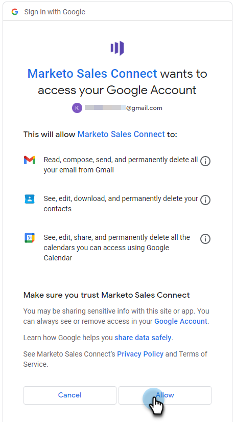

# Anslut till Gmail {#connect-to-gmail}

Att ansluta till Gmail innebär att du får svarsspårning, tillgång till Gmail-leveranskanalen, möjlighet att schemalägga e-postmeddelanden i Gmail och skicka regelefterlevnad.

>[!CAUTION]
>
>Om du är [använda filter](https://support.google.com/mail/answer/6579?hl=en#zippy=%2Ccreate-a-filter%2Cedit-or-delete-filters){target="_blank"} eller regler i ditt Gmail-konto som automatiskt markerar e-postmeddelanden som lästa kan orsaka problem med svarsuppföljningen. Vi rekommenderar att du inaktiverar alla regler som automatiskt markerar e-postmeddelanden som lästa när du använder svarsspårning med Gmail.

1. I Marketo Sales klickar du på kugghjulsikonen och väljer **Inställningar**.

   

1. Under Mitt konto väljer du **E-postinställningar**.

   

1. Klicka på **E-postanslutning** -fliken.

   

1. Klicka **Kom igång**.

   

1. Välj **Jag använder Gmail för att skicka e-post** och klicka **Nästa**.

   

1. Klicka **OK**.

   

1. Om du redan har loggat in på Gmail väljer du det konto du vill ansluta till. Om inte, ange din Gmail-adress och klicka på **Nästa**. I det här exemplet är vi ännu inte inloggade.

   

1. Ange ditt lösenord och klicka på **Nästa**.

   

1. Klicka **Tillåt**.

   

   Du kan använda den här anslutningen för att spåra e-postmeddelanden och även som en leveranskanal.

>[!NOTE]
>
>Gmail tillämpar sina egna sändningsbegränsningar. [Läs mer här](/help/marketo/product-docs/marketo-sales-connect/email/email-delivery/email-connection-throttling.md#email-provider-limits).
