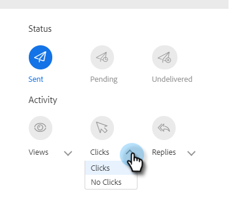

# Översikt över avancerad sökning {#advanced-search-overview}

Genom att använda den avancerade sökningen för att rikta dig till potentiella kunder som har visat, klickat eller svarat på e-postmeddelanden kan du skapa en målinriktad lista över de mest engagerade potentiella kunderna.

## Använda avancerad sökning {#how-to-access-advanced-search}

1. Klicka på **[!UICONTROL Command Center]** i webbprogrammet.

   

1. Klicka på **[!UICONTROL Emails]**.

   

1. Välj lämplig flik.

   

1. Klicka på [!UICONTROL Advanced Search].

   

## Filter {#filters}

**Datum**

Välj datumintervall för sökningen. Förinställda datum uppdateras beroende på vilken e-poststatus du väljer ([!UICONTROL Sent], [!UICONTROL Undelivered], [!UICONTROL Pending]).

**Vem**

Filtrera efter e-postmottagare/avsändare i avsnittet [!UICONTROL Who].

<table>
 <tr>
  <td><strong>Nedrullningsbar meny</strong></td>
  <td><strong>Beskrivning</strong></td>
 </tr>
 <tr>
  <td><strong>[!UICONTROL View As]</strong></td>
  <td>Filtrera efter en specifik avsändare i din Sales Connect-instans (det här alternativet är endast tillgängligt för administratörer).</td>
 </tr>
 <tr>
  <td><strong>[!UICONTROL By Group]</strong></td>
  <td>Filtrera e-postmeddelanden efter en viss grupp mottagare.</td>
 </tr>
 <tr>
  <td><strong>[!UICONTROL By Person]</strong></td>
  <td>Filtrera efter en viss mottagare.</td>
 </tr>
</table>

**När**

Välj efter skapat datum, leveransdatum, misslyckat datum eller schemalagt datum. Vilka alternativ som är tillgängliga varierar beroende på vilken e-poststatus du väljer ([!UICONTROL Sent], [!UICONTROL Undelivered], [!UICONTROL Pending]).

**Kampanjer**

Filtrera e-postmeddelanden efter kampanjdeltagande.

**Status**

Det finns tre e-poststatusar att välja mellan. Typen/aktivitetsalternativen ändras baserat på vald status.

_&#x200B;**Status: Skickat**&#x200B;_

Filtrerar efter din skickade e-postaktivitet. Du kan välja [!UICONTROL views]/[!UICONTROL no views], [!UICONTROL clicks]/[!UICONTROL no clicks] och/eller [!UICONTROL replies]/[!UICONTROL no replies].

_&#x200B;**Status: Väntande**&#x200B;_

Filtrerar efter alla väntande e-postmeddelanden.

<table>
 <tr>
  <td><strong>Status</strong></td>
  <td><strong>Beskrivning</strong></td>
 </tr>
 <tr>
  <td><strong>[!UICONTROL Scheduled]</strong></td>
  <td>E-postmeddelanden som har schemalagts från dispositionsfönstret (Salesforce eller Web App), e-postplugin-program eller en kampanj.</td>
 </tr>
 <tr>
  <td><strong>[!UICONTROL Drafts]</strong></td>
  <td>E-postmeddelanden som är i utkastläge. E-postmeddelanden kräver en ämnesrad och en mottagare för att kunna sparas som ett utkast.</td>
 </tr>
 <tr>
  <td><strong>[!UICONTROL In Progress]</strong></td>
  <td>E-postmeddelanden som håller på att skickas. E-postmeddelanden får inte vara kvar i det här läget i mer än några sekunder.</td>
 </tr>
</table>

_&#x200B;**Status: Olevererad**&#x200B;_

Filtrerar efter e-postmeddelanden som aldrig levererats.

<table>
 <tr>
  <td><strong>Status</strong></td>
  <td><strong>Beskrivning</strong></td>
 </tr>
 <tr>
  <td><strong>[!UICONTROL Failed]</strong></td>
  <td>När ett e-postmeddelande inte kan skickas från Sales Connect (vanliga orsaker är bland annat: e-postmeddelanden skickas till kontakter som avbrutit prenumerationen/blockerats, eller om det uppstod ett problem med att fylla i de dynamiska fälten).</td>
 </tr>
 <tr>
  <td><strong>[!UICONTROL Bounced]</strong></td>
  <td>Ett e-postmeddelande markeras som studsat när det avvisas av mottagarens server. Endast e-postmeddelanden som skickades via Sales Connect-servrar visas här.</td>
 </tr>
 <tr>
  <td><strong>[!UICONTROL Spam]</strong></td>
  <td>När e-postmeddelandet har markerats som skräppost (vanlig term för oombedd e-post) av mottagaren. Endast e-postmeddelanden som skickades via Sales Connect-servrar visas här.</td>
 </tr>
</table>

## Sparade sökningar {#saved-searches}

Så här skapar du en sparad sökning.

1. Klicka på **[!UICONTROL Save Filters As]** när alla filter är på plats.

   

1. Ge sökningen ett namn och klicka på **[!UICONTROL Save]**.

   

Dina sparade sökningar visas i sidofältet till vänster.

