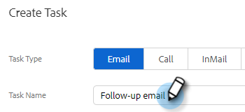
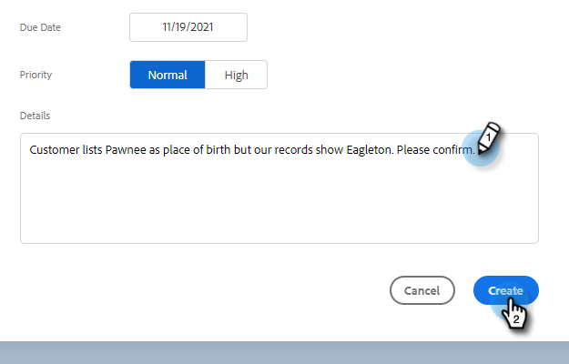

# Tilldela uppgifter till teammedlemmar {#assigning-tasks-to-team-members}

Om du vill samarbeta med andra teammedlemmar kan det vara ett bra sätt att samordna dina prospekteringsinsatser.

>[!NOTE]
>
>Du kan bara tilldela uppgifter för delade kontakter.

1. Klicka på **Kommandocentral**.

   

1. Klicka **Lägg till uppgift**.

   

1. Välj uppgiftstyp.

   

1. Ge uppgiften ett namn.

   

1. Markera den person i ditt team som du vill tilldela uppgiften till i fältet Tilldela uppgift.

   

1. Lägg till den person du vill nå ut till i personfältet.

   

1. Välj förfallodatum.

   

1. Ange prioritet.

   

1. Lägg till viktig information som är relevant för ditt team (valfritt) och klicka på **Skapa**.

   
