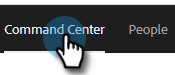

# E-postkolumner och sidlayout för e-post {#email-columns-and-email-page-layout}

Du kan konfigurera alla tillgängliga kolumner så att de visas i e-postavsnittet i [kommandocentralen](/help/marketo/product-docs/marketo-sales-insight/actions/email/command-center/command-center-overview.md). Konfigurationsinställningarna sparas för varje e-postundermapp (t.ex. Levererad, Misslyckad, Schemalagd osv).

## E-postkolumner {#email-columns}

<table> 
 <colgroup> 
  <col> 
  <col> 
 </colgroup> 
 <tbody> 
  <tr> 
   <th>Kolumn</th> 
   <th>Beskrivning</th> 
  </tr> 
  <tr> 
   <td><strong>[!UICONTROL Person]</td> 
   <td>Namn och e-postadress för personen i [!UICONTROL Sales Connect]. Om du klickar på det här fältet öppnas fliken Om i vyn Personinformation.</td> 
  </tr> 
  <tr> 
   <td><strong>[!UICONTROL Name]</td> 
   <td>Namn på personen i [!UICONTROL Sales Connect].</td> 
  </tr> 
  <tr> 
   <td><strong>[!UICONTROL Address]</td> 
   <td>Personens primära e-postadress i [!UICONTROL Sales Connect].</td> 
  </tr> 
  <tr> 
   <td><strong>[!UICONTROL Campaign]</td> 
   <td>Om e-postmeddelandet skickades som en del av en kampanj visas kampanjens namn. Om du klickar på det här fältet kommer du till inställningssidan för den kampanjen.</td> 
  </tr> 
  <tr> 
   <td><strong>[!UICONTROL Template]</td> 
   <td>Visar namnet på mallen (om e-postmeddelandet skickades med ett).</td> 
  </tr> 
  <tr> 
   <td><strong>[!UICONTROL Subject]</td> 
   <td>E-postmeddelandets ämnesrad.</td> 
  </tr> 
  <tr> 
   <td><strong>[!UICONTROL Groups]</td> 
   <td>Visar de grupper som e-postmottagaren tillhör.</td> 
  </tr> 
  <tr> 
   <td><strong>[!UICONTROL Job Title]</td> 
   <td>E-postmottagarens namn.</td> 
  </tr> 
  <tr> 
   <td><strong>[!UICONTROL Company]</td> 
   <td>E-postmottagarens företag.</td> 
  </tr> 
  <tr> 
   <td><strong>[!UICONTROL Email Status]</td> 
   <td>Status som e-postmeddelandet är i. Status: Utkast, Schemalagd, Pågår, Skräppost, Avbruten, Misslyckad, Skickad. Skickade e-postmeddelanden visar en aktivitetsström som visar hur många visningar, klickningar och svar som har gjorts i det e-postmeddelandet.</td> 
  </tr> 
  <tr> 
   <td><strong>[!UICONTROL Date Created]</td> 
   <td>Datum när e-postmeddelandet skapades.</td> 
  </tr> 
  <tr> 
   <td><strong>[!UICONTROL Last Updated]</td> 
   <td>Datum när e-postmeddelandet senast uppdaterades.</td> 
  </tr> 
  <tr> 
   <td><strong>[!UICONTROL Delivery Channel]</td> 
   <td>Namnet på den leveranskanal som användes för att skicka e-postmeddelandet.</td> 
  </tr> 
  <tr> 
   <td><strong>[!UICONTROL Latest Activity]</td> 
   <td>E-postmottagarens senaste engagemang (t.ex. visa, klicka eller svara).</td> 
  </tr> 
  <tr> 
   <td><strong>[!UICONTROL Date Sent]</td> 
   <td>Det datum då e-postmeddelandet skickades.</td> 
  </tr> 
  <tr> 
   <td><strong>[!UICONTROL Follow Up Actions]</td> 
   <td>Snabbåtgärdsknappar som kan användas för uppföljning via e-post, telefon, iMail eller uppgift.</td> 
  </tr> 
  <tr> 
   <td><strong>[!UICONTROL Group Email]</td> 
   <td>Visar en bock om e-postmeddelandet skickades som en del av ett gruppe-postmeddelande.</td> 
  </tr> 
  <tr> 
   <td><strong>[!UICONTROL Task Due Date]</td> 
   <td>Visar förfallodatumet för aktiviteter som är relaterade till e-postmeddelandet. Uppgifter kan relateras till ett e-postmeddelande genom att skapas från snabbåtgärdsknapparna i e-postlistan.</td> 
  </tr> 
  <tr> 
   <td><strong>[!UICONTROL Email Action]</td> 
   <td>Snabbåtgärdsknappar som kan användas för att utföra åtgärder i e-postmeddelandet. Beroende på status för e-postmeddelandet kan följande åtgärder vara tillgängliga: Arkiv, Slutfört, Ta bort, Försök skicka igen, Avarkivera.</td> 
  </tr> 
  <tr> 
   <td><strong>[!UICONTROL Task Type]</td> 
   <td>Visar uppgiftstypen för en aktivitet som är relaterad till e-postmeddelandet. Uppgifter kan relateras till ett e-postmeddelande genom att skapas från snabbåtgärdsknapparna i e-postlistan.</td> 
  </tr> 
  <tr> 
   <td><strong>[!UICONTROL Date Failed]</td> 
   <td>Visar det datum då e-postmeddelandet misslyckades om e-postmeddelandet inte levererades.</td> 
  </tr> 
 </tbody> 
</table>

## Inställningar för sidlayout för e-post {#email-page-layout-settings}

Du kan konfigurera layouten genom att följa dessa steg.

1. Klicka på **[!UICONTROL Command Center]** i webbprogrammet.

   

1. Markera avsnittet **[!UICONTROL Emails]**.

   

1. Klicka på knappen Konfiguration. Dina alternativ är bland annat: välja hur många rader du vill ha, välja vilka fält du vill ska visas och välja om du vill att gruppmeddelanden ska samlas i ett enda objekt i rutnätet (eller om du vill att alla e-postmeddelanden som är en del av ett e-postrutnät ska visas som ett enda objekt).

   

1. Klicka utanför konfigurationslådan när du är klar för att spara ändringarna.
