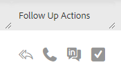

# Snabbåtgärder i [!UICONTROL Command Center] {#quick-actions-in-the-command-center}

Det finns två typer av snabbåtgärdskolumner i e-postrutnätet. E-poståtgärder, som gör att du kan vidta åtgärder i e-postmeddelandet, och uppföljningsåtgärder, som gör att du kan vidta interaktionsåtgärder med bara några klick.

## Snabbåtgärder {#quick-actions}

Snabba e-poståtgärder är dynamiska och uppdateras beroende på de mest relevanta åtgärderna för statusen för det e-postmeddelande du tittar på. Det finns högst två synliga snabbåtgärder för e-post för varje e-poststatus. Du kan se vilka e-postsnabbåtgärder som är tillgängliga för varje status nedan.

**[!UICONTROL Delivered]**

| Status | Beskrivning |
|---|---|
| [!UICONTROL Archive] | Kommer att lägga till e-postmeddelandet i den arkiverade mappen och stoppa alla inaktiveringsvyer och klicka på spårning för det e-postmeddelandet. |
| [!UICONTROL Success] | Markerar e-postmeddelandet som lyckat att rapporteras i mallanalyser. |

**[!UICONTROL Archived]**

<table>
 <colgroup>
  <col>
  <col>
 </colgroup>
 <tbody>
  <tr>
   <td>[!UICONTROL Unarchive]</td>
   <td>Flyttar tillbaka e-postmeddelandet till den levererade mappen och återaktiverar vyn/klickspårningen.</td>
  </tr>
  <tr>
   <td>[!UICONTROL Delete]</td>
   <td>
E-postmeddelandet tas bort. <strong>Obs!</strong> E-postmeddelanden som skickades som en del av en kampanj kan inte tas bort.
</td>
  </tr>
 </tbody>
</table>

**[!UICONTROL Draft] och [!UICONTROL Scheduled]**

<table>
 <colgroup>
  <col>
  <col>
 </colgroup>
 <tbody>
  <tr>
   <td>[!UICONTROL Edit]</td>
   <td>Öppnar e-postmeddelandet i dispositionsfönstret som ska redigeras.</td>
  </tr>
  <tr>
   <td>[!UICONTROL Delete]</td>
   <td>
E-postmeddelandet tas bort. <strong>Obs!</strong> E-postmeddelanden som skickades som en del av en kampanj kan inte tas bort.
</td>
  </tr>
 </tbody>
</table>

**[!UICONTROL Failed], [!UICONTROL Bounced] och[!UICONTROL Spam]**

<table>
 <colgroup>
  <col>
  <col>
 </colgroup>
 <tbody>
  <tr>
   <td>[!UICONTROL Retry Send]</td>
   <td>Kommer omedelbart att försöka skicka om e-postmeddelandet.</td>
  </tr>
  <tr>
   <td>[!UICONTROL Delete]</td>
   <td>
E-postmeddelandet tas bort. <strong>Obs!</strong> E-postmeddelanden som skickades som en del av en kampanj kan inte tas bort.
</td>
  </tr>
 </tbody>
</table>

**[!UICONTROL Follow-up Actions]**

| Funktion | Beskrivning |
|---|---|
| Skicka e-post med uppföljning | Öppnar dispositionsfönstret med den markerade infogade e-posttexten tillagd och klar att skickas till mottagaren. |
| Ring | Öppnar säljtelefonen för att ringa ett samtal till e-postmottagaren. |
| Skicka via e-post | Dirigerar om till [!DNL LinkedIn] för att skicka ett InMail-meddelande till personen. |
| Skapa uppgift | Öppnar popup-fönstret för att skapa en påminnelseuppgift. |
