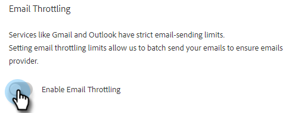

# Begränsning för e-postanslutning {#email-connection-throttling}

Genom att integrera ditt [!DNL Sales Connect]-konto för att skicka via [!DNL Exchange]- eller Gmail-e-postleverantörer kan du konfigurera och optimera e-postleveransen för :1-säljkommunikation. Om du vill att systemen ska vara felfria och att kontona ska vara säkra tillämpar Gmail och [!DNL Exchange] e-postsändningsbegränsningar. Dessa begränsningar är öppna för att ökas eller minskas efter leverantörens gottfinnande.

## Översikt {#overview}

Begränsning av e-postanslutning gör att Sales Connect-administratörer kan konfigurera sändningsfrekvensen för e-postmeddelanden när Gmail eller Exchange används som leveranskanal, så att den hastighet med vilken e-postmeddelanden skickas till leveranskanalleverantören inte överskrider de tvingande gränserna.

När gränserna genomgående överskrids kan detta ibland ses som misstänkt beteende från leverantören av leveranskanalen, vilket får e-postmeddelanden att misslyckas och ibland även ett konto att inaktiveras.

## Saker att notera {#things-to-note}

* Aktiveras automatiskt när en användare ansluter till Gmail eller [!DNL Exchange]
* Kan anpassas om du vill öka eller minska inställningarna från rekommendationer efter dina behov
* Endast stryper e-postmeddelanden som skickas via Gmail eller [!DNL Exchange], stryper inte för anpassad leveranskanal
* Begränsningen för e-postanslutning placerar varje enskild användare i e-postmeddelanden separat eftersom varje användare har sin egen anslutning till sin e-postleverantör

## Konfigurera inställningarna för begränsning av e-postanslutning {#configuring}

1. Klicka på kugghjulsikonen och välj **[!UICONTROL Settings]**.

   

1. Klicka på [!UICONTROL Admin Settings] under **[!UICONTROL General]**.

   

1. Klicka på skjutreglaget **[!UICONTROL Enable Email Throttling]** i e-postanslutningsbegränsningskortet till höger.

   

1. Ange önskad batchstorlek för e-postmeddelanden som ska skickas till e-postkanalleverantören på kortet för e-postanslutningsbegränsning till höger.

   

1. Ange hur lång tid det ska ta innan varje batch skickas. I det här exemplet väljer vi 25 e-postmeddelanden var 45:e sekund.

   

1. Klicka på **[!UICONTROL Save]**.

   

När ändringarna har sparats kommer alla användare att få sina e-postmeddelanden skickade gruppvis till det anslutna Gmail- eller [!DNL Exchange]-kontot för leverans.

## Begränsningar för e-postleverantör {#email-provider-limits}

### [!DNL Outlook 365] {#outlook}

Företag

* 10 000 per dag
* 30 per minut
* 500 mottagare per e-post

Mer information [finns här](https://docs.microsoft.com/en-us/office365/servicedescriptions/exchange-online-service-description/exchange-online-limits?redirectedfrom=MSDN#RecipientLimits).

### Gmail {#gmail}

* 2000 per dag (500 för testversioner och flaggade konton)
* 2 e-postmeddelanden per sekund (API-gräns)
* 2 000 mottagare per meddelande (max 500 för externa mottagare)

Mer information [finns här](https://support.google.com/a/answer/166852?hl=en).

### [!DNL Microsoft Exchange Server (2010, 2013)] {#microsoft-exchange}

Begränsningar anges av organisationens IT-avdelning när servern hanteras av organisationen. Kontakta nätverks- eller systemadministratören om du vill ha mer information.

>[!MORELIKETHIS]
>
>* [Översikt över leveranskanalen](/help/marketo/product-docs/marketo-sales-connect/email/email-delivery/delivery-channel-overview.md)
>* [E-postanslutning för Gmail-användare](/help/marketo/product-docs/marketo-sales-connect/email-plugins/gmail/email-connection-for-gmail-users.md)
>* [E-postanslutning för Outlook-användare](/help/marketo/product-docs/marketo-sales-connect/email-plugins/msc-for-outlook/email-connection-for-outlook-users.md)
