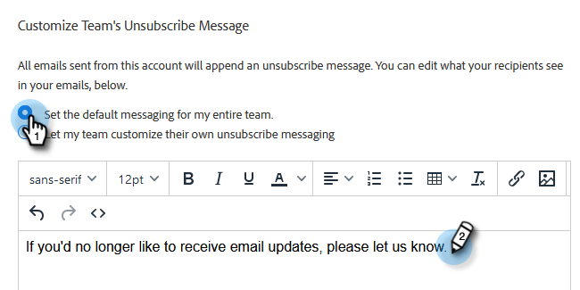

# Anpassa meddelande om att avbryta prenumeration på länk {#customize-unsubscribe-link-message}

Vi har alltid tillåtit team att anpassa sina länkmeddelanden för att avbryta prenumerationen, men administratörer har möjlighet att ställa in meddelanden för att avbryta prenumerationen för hela teamet för att säkerställa ett konsekvent budskap.

>[!NOTE]
>
>Du kan inte använda en länk för att avbryta prenumerationen från tredje part med [!DNL Marketo Sales] eftersom den här informationen inte kommer att hämtas tillbaka till vår databas.

1. Klicka på kugghjulsikonen och välj **[!UICONTROL Settings]**.

   

1. Klicka på [!UICONTROL Admin Settings] under **[!UICONTROL Unsubscribes]**.

   

1. Kontrollera om det här meddelandet är standard för hela teamet eller om du vill att teamet ska kunna skapa egna meddelanden (i det här exemplet väljer vi standardmeddelanden). Skriv dina anpassade meddelanden i textrutan.

   

1. Markera den text du vill att användarna ska klicka på för att komma till sidan för att avbryta prenumerationen och klicka sedan på länkikonen.

   

   >[!NOTE]
   >
   >Det spelar ingen roll vilken URL du anger. När e-postmeddelandet skickas kommer den första (eller enda) hyperlänken automatiskt att länka till standardsidan för avanmälan.

1. Ange en URL-adress, kontrollera om du vill att länken ska öppnas i det aktuella eller ett nytt fönster och klicka sedan på **[!UICONTROL Save]**.

   

1. Klicka på **[!UICONTROL Save]** längst ned för att spara ändringarna.

   
