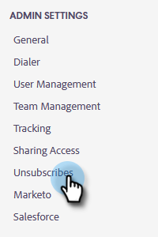
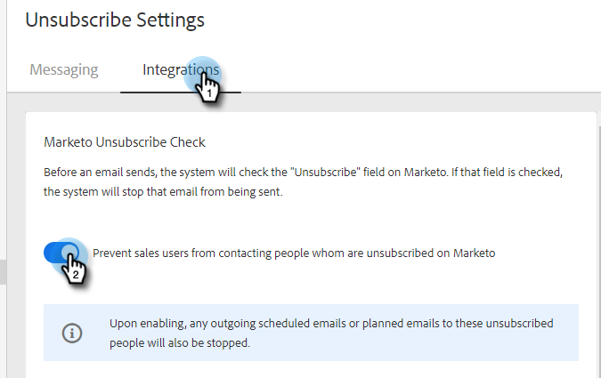

# [!UICONTROL Marketo Unsubscribe Check] {#marketo-unsubscribe-check}

[!UICONTROL Marketo Unsubscribe Check] använder teamets anslutning till Marketo för att förhindra att e-postmeddelanden skickas till personer som har avbrutit prenumerationen i Marketo Lead Management-system. När en säljanvändare skickar ett e-postmeddelande med [!DNL Marketo Sales], görs ett API-anrop till Marketo för att kontrollera om e-post-ID:t har avbrutits. I så fall blockerar vi e-postmeddelandet från att skickas.

>[!NOTE]
>
>**Administratörsbehörigheter krävs**

## Aktiverar {#turning-it-on}

1. Klicka på kugghjulsikonen och välj **[!UICONTROL Settings]**.

   

1. Klicka på [!UICONTROL Admin Settings] under **[!UICONTROL Unsubscribes]**.

   

1. Klicka på fliken **[!UICONTROL Integrations]**. Klicka på skjutreglaget i avsnittet [!UICONTROL Marketo Unsubscribe Check] för att aktivera kontrollen.

   

## Saker att veta {#things-to-know}

The Marketo Unsubscribe check..

* Räknas inte med dina API-gränser
* Kräver en Marketo-anslutning
* Är en global inställning
* Blockerar e-postmeddelanden som skickas från webbprogrammet, e-postklienter och [!DNL Salesforce]
