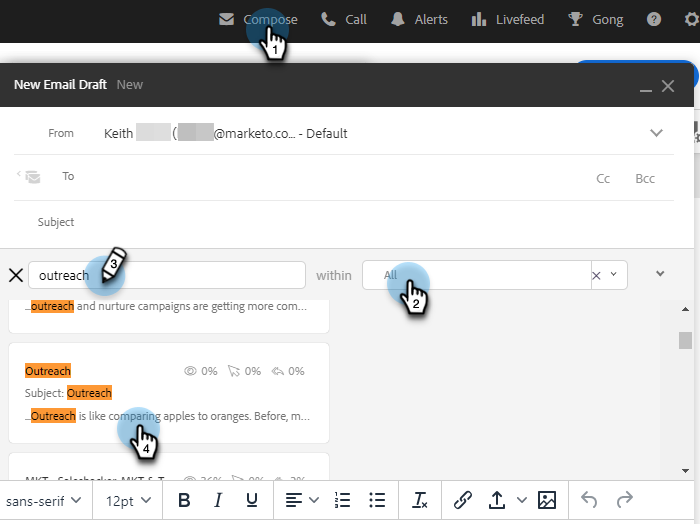

# E-postmallar för transaktionsförsäljning {#transactional-sales-email-templates}

Om ditt team skickar ut transaktionsbaserade eller icke-kommersiella e-postmeddelanden kan du markera en e-postmall som icke-kommersiell så att den kan kringgå avbeställning.

## Saker att notera {#things-to-note}

* Icke-kommersiella e-postmeddelanden kommer att kringgå avbeställningar av försäljning och [Avbeställ Marketo Engage](/help/marketo/product-docs/marketo-sales-insight/actions/email/unsubscribes/marketo-unsubscribe-check.md){target="_blank"}, but will not bypass [blocked domains](/help/marketo/product-docs/marketo-sales-insight/actions/admin/blocked-domains.md){target="_blank"}.

* Avbeställningsmeddelanden läggs inte automatiskt till icke-kommersiella e-postmeddelanden, även om [append unsubscribe message admin setting](/help/marketo/product-docs/marketo-sales-insight/actions/email/unsubscribes/auto-append-unsubscribe-message-setting.md){target="_blank"} is enabled. However, the `{{team_unsubscribe}}` [dynamic field](/help/marketo/product-docs/marketo-sales-insight/actions/templates/dynamic-fields.md){target="_blank"} kommer fortfarande att fylla i ditt teames meddelande om att avbryta prenumerationen.

## Konfigurera en e-postmall för icke-kommersiell användning {#configure-an-email-template-for-non-commercial-use}

1. Klicka på i sidhuvudet **Mallar**.

   

1. Sök efter och välj den mall som du vill uppdatera.

   

1. Aktivera alternativet för icke-kommersiell e-post under Mallinställningar.

   

## Skicka ett icke-kommersiellt e-postmeddelande {#send-a-non-commercial-email}

>[!NOTE]
>
>När du har valt en person som inte längre prenumererar markeras personen som orange.

1. Klicka på i sidhuvudet **Skapa**. Sök efter och välj önskad icke-kommersiell mall.

   

1. Användarna ser en banderoll som visar att de har valt en icke-kommersiell e-postmall.

   

1. Klicka **Skicka**.

   

E-postmeddelandet skickas fortfarande även om personen avbeställer prenumerationen.
