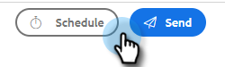

# Disponera massutskick med Markera och skicka {#composing-bulk-emails-with-select-and-send}

Så här skickar/redigerar du e-postmeddelanden med alternativet [!UICONTROL Select] och [!UICONTROL Send].

## Skicka e-post {#sending-emails}

1. Navigera till **[!UICONTROL People page]**.

   

1. Markera de personer som du vill skicka e-post till.

   

   >[!NOTE]
   >
   >Högst 200 personer kan väljas när du använder Markera och Skicka.

1. Klicka på knappen **[!UICONTROL Email Selected]**.

   

1. Ange en ämnesrad, välj en mall (eller skapa e-postmeddelandet från grunden) och skicka/[schemalägg](/help/marketo/product-docs/marketo-sales-connect/email/using-the-compose-window/scheduling-an-email.md) e-postmeddelandet.

   

   >[!NOTE]
   >
   >Om du har valt en mall och vill kontrollera att alla dynamiska fält fylls i korrekt innan du skickar den klickar du på **[!UICONTROL Preview Dynamic Fields]**. Se till att alla mottagare i det stora sidofältet är markerade för att förhandsgranska alla e-postmeddelanden. Om du markerar ett e-postmeddelande och klickar på **[!UICONTROL Preview Dynamic Fields]** förhandsgranskas endast det meddelandet.

## Redigera e-postmeddelanden {#editing-emails}

**Massredigeringar**

1. Följ steg 1-3 i avsnittet [Skicka e-post](#sending-emails) ovan.

   >[!NOTE]
   >
   >Som standard markeras alla mottagare. Om du klickar på en individ och vill markera alla igen klickar du på **[!UICONTROL All Recipients]**. Som påminnelse måste alla mottagare vara markerade för att kunna göra massredigeringar.

1. Gör ändringarna i redigeraren. Du kan skapa ett nytt e-postmeddelande eller redigera en mall (i det här exemplet skapar vi ett nytt e-postmeddelande).

   

   >[!NOTE]
   >
   >Du kan klicka på en viss e-postmottagare för att se ändringarna som har skickats till det e-postmeddelandet.

1. Klicka på **[!UICONTROL Send]** (eller [[!UICONTROL Schedule]](/help/marketo/product-docs/marketo-sales-connect/email/using-the-compose-window/scheduling-an-email.md)) om du vill skicka e-postmeddelanden till alla mottagare med de satsvisa uppdateringarna som du har gjort.

   

**Redigera alla e-postmeddelanden**

Slutför gruppuppdateringar innan du anpassar varje e-postmeddelande, eftersom en gruppuppdatering skriver över ändringar i alla e-postmeddelanden i det stora sidofältet.

1. Följ steg 1-4 i avsnittet [Skicka e-post](#sending-emails).

   >[!NOTE]
   >
   >Som standard markeras alla mottagare. Om du klickar på en individ och vill markera alla igen klickar du på **[!UICONTROL All Recipients]**. Som påminnelse måste alla mottagare vara markerade för att kunna göra massredigeringar.

1. Välj en enskild mottagare.

   

1. Gör ändringarna i redigeraren.

   

   >[!NOTE]
   >
   >Här kan du redigera ett enda e-postmeddelande i grupplisten utan att uppdatera resten av e-postmeddelandena.

   >[!TIP]
   >
   >Du kan klicka på andra mottagare för att se att de ändringar du har gjort för den tidigare valda mottagaren inte visas.

1. Klicka på **[!UICONTROL Send]** (eller [[!UICONTROL Schedule]](/help/marketo/product-docs/marketo-sales-connect/email/using-the-compose-window/scheduling-an-email.md)) om du vill skicka e-postmeddelanden till alla mottagare med de satsvisa uppdateringarna som du har gjort.

   

   >[!MORELIKETHIS]
   >
   >* [Alternativ för massutskick](/help/marketo/product-docs/marketo-sales-insight/actions/email/using-the-compose-window/bulk-emailing-options.md)
   >* [Använda en mall i dispositionsfönstret](/help/marketo/product-docs/marketo-sales-connect/email/using-the-compose-window/using-a-template-in-the-compose-window.md)
   >* [Dynamiska fält](/help/marketo/product-docs/marketo-sales-connect/templates/dynamic-fields/how-to-insert-dynamic-fields.md)
