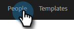

# Skicka e-post via gruppe-post {#sending-emails-via-group-email}

Så här skickar/redigerar du e-post med alternativet Gruppera e-post.

## Skicka ett gruppe-postmeddelande {#sending-a-group-email}

1. Klicka på **Folk** -fliken.

   

1. Markera gruppen som du vill skicka e-post till.

   

1. Klicka på knappen Gruppera åtgärder och välj **E-postgrupp**.

   

1. Fyll i e-postmeddelandet (eller välj en mall) och skicka (eller schemalägg) det.

   

## Redigera en gruppe-postadress {#editing-a-group-email}

1. Skapa ett gruppe-postmeddelande med [Steg 1-3 ovan](#sending-a-group-email).

1. [Välj en mall](/help/marketo/product-docs/marketo-sales-insight/actions/email/using-the-compose-window/using-a-template-in-the-compose-window.md)eller fylla i e-postmeddelandet.

   

1. När e-postmeddelandet är klart kan du nu förhandsgranska varje e-postmeddelande i listan för att se om de dynamiska fälten fylls i korrekt.

   

1. Välj önskad mottagare och klicka på **Förhandsgranska dynamiska fält**. Visa förhandsgranskningen till höger.

   

   >[!NOTE]
   >
   >Du kan göra flera ändringar i e-postmeddelandet/mallen när du skickar ut ett gruppmeddelande, men du kan inte göra unika redigeringar för specifika mottagare i listan.

>[!MORELIKETHIS]
>
>* [Alternativ för massutskick](/help/marketo/product-docs/marketo-sales-insight/actions/email/using-the-compose-window/bulk-emailing-options.md)
>* [Använda en mall i dispositionsfönstret](/help/marketo/product-docs/marketo-sales-insight/actions/email/using-the-compose-window/using-a-template-in-the-compose-window.md)
