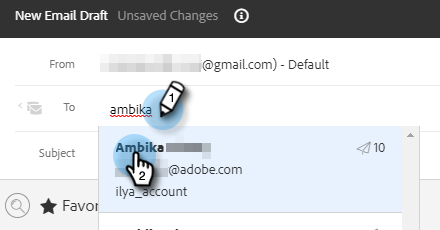
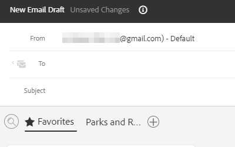

# Använda en mall i dispositionsfönstret {#using-a-template-in-the-compose-window}

## Söka efter och använda mallar {#finding-and-using-templates}

1. Skapa ditt e-postutkast (det finns flera sätt att göra detta, i det här exemplet väljer vi **Disponera** i sidhuvudet).

   

1. Fyll i fältet Till.

   

1. Klicka på sökikonen i mallavsnittet för att öppna mallsökfältet.

   

   >[!TIP]
   >
   >Vi rekommenderar att du fäster kategorin&quot;Alla&quot; så att du snabbt kan söka i hela mallbiblioteket, eftersom du ofta behöver söka igenom alla mallar för att hitta det du söker efter. När du har markerat en fast kategori och klickar på sökikonen används sökningen som standard i den valda kategorin.

1. Välj en kategori att söka i (eller markera Alla om du vill söka i alla kategorier).

   

1. Sök efter mallnamn, ämnesrad eller brödtext i e-postmeddelandet. Klicka på önskad mall för att markera den.

   

   >[!NOTE]
   >
   >Om du väljer en annan mall ersätts all information som finns i redigeraren. Om du gör några ändringar måste du kopiera dem innan du väljer en annan mall.

## Fästa mallkategorier i dispositionsfönstret {#pinning-template-categories-in-the-compose-window}

Favorit **upp till fem** särskilda mallkategorier för att snabbt få tillgång till de mallar du använder mest.

1. Skapa ditt e-postutkast (det finns flera sätt att göra detta, i det här exemplet väljer vi **Disponera** i sidhuvudet).

   

1. Klicka på **+** -ikon bredvid Favoriter.

   

1. Klicka på **Fäst en kategori** och välj önskad kategori.

   

1. Klicka **Spara ändringar** när du är klar (valfritt: upprepa steg 3 för att lägga till fler).

   

   >[!TIP]
   >
   >Du kan ändra ordning på dina fasta kategorier genom att dra och släppa innan du sparar ändringarna.

   

   >[!NOTE]
   >
   >**Favoriter** finns där som standard. Den innehåller e-postmallar för favoriter, inte kategorier.

   Den valda kategorin är nu fäst.
