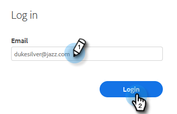

# Ändra ditt Marketo-lösenord {#change-your-marketo-sales-password}

Behöver du ändra ditt lösenord? Så här gör du.

## Ändra ditt lösenord när du är inloggad {#change-your-password-while-signed-in}

1. Klicka på kugghjulsikonen och välj **Inställningar**.

   

1. Sidan Min profil öppnas som standard. Under Kontoinformation väljer du **Ändra lösenord** kryssrutan.

   

1. Ange ditt aktuella lösenord. Ange den nya och skriv den på nytt så att den matchar. Klicka **Spara** när det är klart.

   

>[!NOTE]
>
>Lösenord måste:
>
>* Innehåller minst nio tecken
>* Använd både VERSALER och gemener
>* Inkludera ett tal
>* Inkludera ett specialtecken

## Ändra ditt lösenord när du loggar ut {#change-your-password-while-signed-out}

1. Navigera till [Inloggning för Sales Connect](https://toutapp.com/login) sida. Ange din e-postadress och klicka på **Inloggning**.

   

1. Klicka **Glömt lösenord**.

   

1. Ange den e-postadress som är kopplad till kontot och klicka på **Skicka Återställ e-post**.

   

1. Vi skickar ett e-postmeddelande för att verifiera att kontoägaren vill ändra lösenordet. Klicka **Återställ lösenord**.

   

   >[!NOTE]
   >
   >Kontrollera din skräppostmapp också, eftersom det här e-postmeddelandet ibland kan hamna där.

1. Ange och bekräfta ditt nya lösenord. Klicka **Ange lösenord** när det är klart.

   
