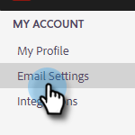

# Lägg till eller uppdatera din e-postsignatur {#add-or-update-your-email-signature}

Vi vill att e-postmeddelanden från Marketo Sales ska kännas som en sömlös upplevelse när de skickas från din egen e-postklient. Ett bra sätt att göra detta är att lägga till din e-postsignatur.

1. Klicka på kugghjulsikonen och välj **[!UICONTROL Settings]**.

   

1. Välj [!UICONTROL My Account] under **[!UICONTROL Email Settings]**.

   

1. På fliken **[!UICONTROL Address and Signature]** väljer du den e-postadress som du vill skapa en signatur för.

   

1. Klicka på [!UICONTROL Signature] på **[!UICONTROL Edit]**-kortet.

   

1. Ange önskad text (eller bilder) och klicka på **[!UICONTROL Save]**.

   

   >[!TIP]
   >
   >Se till att din signatur på dispositionsskärmen ser ut ungefär som den signatur som visas i din e-postklient.
