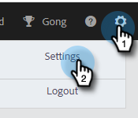

# Verifiera din e-postadress {#verify-your-email}

Om du har en e-postidentitet som inte har verifierats följer du stegen nedan.

1. Klicka på kugghjulsikonen uppe till höger och välj **Inställningar**.

   

1. Under Mitt konto klickar du på **E-postinställningar**.

   

1. Under Adress och Signatur hittar du det e-postmeddelande du vill verifiera och klickar på **Skicka bekräftelsemeddelande igen**. Ett nytt bekräftelsemeddelande skickas.

   

1. Klicka **Skicka igen**.

   

1. Mottagaren öppnar sedan e-postmeddelandet och följer stegen för att verifiera e-postadressen.

   

>[!NOTE]
>
>Om du inte får bekräftelsemeddelandet kontrollerar du din skräppostmapp. Om den inte är där, kontakta [Marketo Support](https://nation.marketo.com/t5/Support/ct-p/Support).
