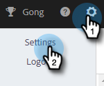
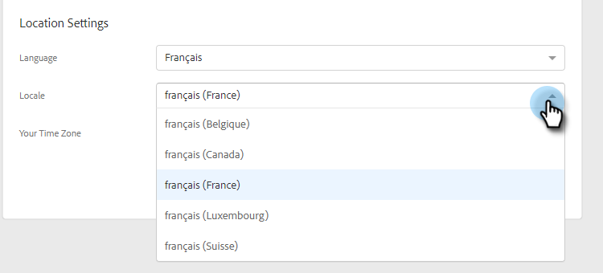

# Hantera din profil {#manage-your-profile}

På sidan Min profil kan du uppdatera ditt namn, kontots språk/språk/tidszon och ändra ditt lösenord.

## Kontoinformation {#account-details}

Här kan du uppdatera ditt namn och/eller lösenord.

1. Klicka på kugghjulsikonen och välj **Inställningar**.

   

1. Sidan Min profil öppnas som standard. Om du vill uppdatera ditt namn skriver du bara in ändringarna och klickar på **Spara**.

   

>[!NOTE]
>
>Din e-postadress är inställd på att endast visas. Om du behöver ändra något också, kontakta [Marketo Support](https://nation.marketo.com/t5/Support/ct-p/Support).

Du kan också ändra ditt lösenord i det här avsnittet. Stegen beskrivs i det här dokumentet.

## Dina integreringar {#your-integrations}

Till höger på sidan visas statusen för alla dina kontoanslutningar under Dina integreringar.

>[!NOTE]
>
>Om du använder Exchange On Prem tillsammans med Marketo Sales uppdateras inte hälsokontrollerna för integrering av leveranskanalen (första radobjektet) eller Spåra svar (andra radobjektet). Vi arbetar för att stödja detta i en framtida version.

## Tidszon {#time-zone}

Så här ändrar du kontots språk, språk och/eller tidszon.

>[!NOTE]
>
>Språk som stöds: Engelska, franska, tyska, japanska, portugisiska, spanska.

1. Klicka på kugghjulsikonen och välj **Inställningar**.

   

1. Klicka på knappen **Språk** och gör ditt val.

   

1. Språk avser här regionen där språket talas. Som standard väljs ett språk när du ändrar det, men om du vill ändra det manuellt klickar du på **Språk** och gör ditt val.

   

1. Klicka på **Din tidszon** och gör ditt val.

   

1. Klicka **Spara** när det är klart.

   

Et voilà!
