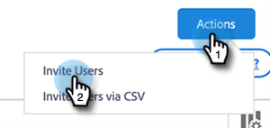

# Handbok för administration av Sales Insight Actions {#sales-insight-actions-admin-setup-guide}

>[!NOTE]
>
>Marketo Sales Insight Actions är ett webbaserat program som integreras exklusivt med Salesforce CRM via [Marketo Sales Insight-paketet](/help/marketo/product-docs/marketo-sales-insight/msi-for-salesforce/installation/install-marketo-sales-insight-package-in-salesforce-appexchange.md){target="_blank"}. Det kallas ibland&quot;Marketo Sales&quot; eller&quot;Actions&quot;.

>[!PREREQUISITES]
>
>* Bekräfta med kontogruppen på Adobe (din kontohanterare) att MSI-åtgärder har aktiverats för ditt Marketo Engage-konto (om du inte har någon kontohanterare kontaktar du [Marketo support](https://nation.marketo.com/t5/support/ct-p/Support){target="_blank"}).
>* Din Marketo/Salesforce-synkronisering måste vara konfigurerad.

<table>
 <tr>
  <th>Persona</th>
  <th>Steg</th>
 </tr>
 <tr>
  <td>Marketo Admin</td>
  <td>Ställ in Marketo-försäljningskonto</td>
 </tr>
 <tr>
  <td>Marketo Admin eller  [!DNL Salesforce] Admin</td>
  <td>Koppla Marketo Sales-konto till [!DNL Salesforce]</td>
 </tr>
 <tr>
  <td>Marketo Admin</td>
  <td>Anslut Marketo-försäljningskonto till Marketo</td>
 </tr>
 <tr>
  <td>Marketo Admin</td>
  <td>Initiera datasynkronisering från Marketo till Marketo försäljningskonto</td>
 </tr>
 <tr>
  <td>Marketo Admin</td>
  <td>Bjud in användare till MSI-Actions</td>
 </tr>
 <tr>
  <td>[!DNL Salesforce] Administratör</td>
  <td>Installera/uppgradera MSI-paket i [!DNL Salesforce]</td>
 </tr>
 <tr>
  <td>[!DNL Salesforce] Administratör</td>
  <td>Konfigurera MSI-åtgärder i [!DNL Salesforce]</td>
 </tr>
</table>

## Ställ in Marketo försäljningskonto {#set-up-marketo-sales-account}

1. Klicka på **[!UICONTROL Admin]** i Marketo.

   

   >[!NOTE]
   >
   >Om du inte ser ett klient-ID och klienthemlighet på integreringsinformationskortet aktiverar du åtgärdsinstansen genom att bjuda in den första användaren, så visas klient-ID och klienthemlighet.

1. Klicka på **Sales Insight** och sedan på **Actions Config**. Välj i en lista över Marketo-administratörer som ska bjudas in och klicka på **Skicka inbjudan**.

   

Användaren får ett e-postmeddelande med steg för att få åtkomst till kontot.

>[!NOTE]
>
>Ytterligare användare läggs inte till via Marketo utan läggs i stället till via sidan Användarhantering för försäljningskonto. [Klicka här](/help/marketo/product-docs/marketo-sales-connect/admin/invite-users.md){target="_blank"} om du vill veta mer om hur du lägger till fler användare.

## Anslut Marketo-försäljningskonto till [!DNL Salesforce] {#connect-marketo-sales-account-to-salesforce}

1. Klicka på kugghjulsikonen på ditt Marketo-försäljningskonto och välj **[!UICONTROL Settings]**.

   

1. Klicka på [!UICONTROL Admin Settings] under **[!UICONTROL Salesforce]**.

   

1. Klicka på [!UICONTROL Connections & Customizations] på fliken **[!UICONTROL Connect]**.

   

1. Klicka på **[!UICONTROL OK]**.

   

Om du redan är inloggad på Salesforce är du ansluten. Annars blir du ombedd att logga in.

## Anslut Marketo till ditt konto för säljappar {#connect-marketo-to-your-sales-apps-account}

1. Klicka på kugghjulsikonen på ditt Marketo-försäljningskonto och välj **[!UICONTROL Settings]**.

   

1. Klicka på [!UICONTROL Admin Settings]Marketo **under**.

   

1. Klicka på **[!UICONTROL connect]**. Ditt konto ansluts då.

   

>[!NOTE]
>
>Om det inte ansluter kopierar du inloggningsuppgifterna från fliken Åtgärder i Marketo Sales Insight och klistrar in dem på fliken Konfigurera.

## Initiera datasynkronisering {#initiate-data-sync}

Synkroniseringen av datafältet för Sales Insight Actions gör att systemet kan hämta personinformation från din Marketo Engage-databas till din Sales Insight Actions-databas, hålla persondata uppdaterade och se till att aktiviteter loggas till rätt poster i Marketo och [!DNL Salesforce].

>[!CAUTION]
>
>När du har initierat datasynkronisering bör du **inte** ta bort den ursprungliga användaren från instansen Sales Insight Actions. Det här är användaren som den första inbjudan skickades till.

1. Klicka på **[!UICONTROL Admin]** i Marketo.

   

1. Klicka på **[!UICONTROL Sales Insight]**.

   

1. Klicka på fliken **[!UICONTROL Actions Config]**. Klicka på **[!UICONTROL Sync]** i synkroniseringskortet för åtgärdsfält.

   

1. En förhandsgranskning av fälten som ska synkroniseras visas. Klicka på **[!UICONTROL Start Sync]**.

   

Personposter som finns i Marketo och [!DNL Salesforce] synkroniseras med ditt Marketo Sales Apps-konto.

>[!NOTE]
>
>[Klicka här](/help/marketo/product-docs/marketo-sales-insight/actions/admin/sync-sales-action-data-with-marketo-and-salesforce.md){target="_blank"} om du vill veta mer om hur människor och aktivitetsdata synkroniseras mellan Sales Insight Actions, Marketo och Salesforce.

## Bjud in enskilda användare till MSI-åtgärder {#invite-individual-users-to-msi-actions}

1. Klicka på kugghjulsikonen på ditt Marketo-försäljningskonto och välj **[!UICONTROL Settings]**.

   

1. Välj [!UICONTROL Admin Settings] under **[!UICONTROL User Management]**.

   

1. Klicka på **[!UICONTROL Actions]** och välj **[!UICONTROL Invite Users]**.

   

1. Ange e-postadress(er) och klicka på **[!UICONTROL Invite]**.

   

>[!NOTE]
>
>Som standard läggs alla nya medlemmar till i gruppen Alla.

Du får ett bekräftelsemeddelande.

## Bjud in användare via CSV till MSI-åtgärder {#invite-users-via-csv-to-msi-actions}

1. Klicka på kugghjulsikonen på ditt Marketo-försäljningskonto och välj **[!UICONTROL Settings]**.

   

1. Välj [!UICONTROL Admin Settings] under **[!UICONTROL User Management]**.

   

1. Klicka på **[!UICONTROL Actions]** och välj **[!UICONTROL Invite Users via CSV]**.

   

1. Bläddra efter CSV-filen på datorn, markera den och klicka på **[!UICONTROL Next]**.

   

1. Bekräfta att fälten är korrekt mappade och klicka på **[!UICONTROL Invite]**.

   

Du får ett bekräftelsemeddelande när inbjudningarna har skickats.

>[!NOTE]
>
>När detta är klart kan du antingen uppgradera ditt befintliga MSI-paket eller installera ett nytt och gå vidare till [konfigurera MSI-åtgärder i Salesforce](/help/marketo/product-docs/marketo-sales-insight/actions/crm/salesforce-package-configuration/sales-insight-actions-configuration-in-salesforce.md){target="_blank"}.
