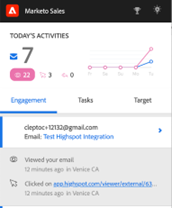

# Integrering med högdagrar {#highspot-integration}

Säljarna får tillgång till Highspot-funktioner från Sales Insight Actions och får bättre synlighet, effektivitet och prestanda under hela säljcykeln. Sales Insight Action-användare kan välja säljmaterial som lagras på Highspot-plattformen och infoga det direkt i e-postmeddelanden, e-postmallar och säljkampanjer, samtidigt som de samlar in innehållsspårning och analyser inom Highspot- och Sales Insight-åtgärder.

## Aktivera integrering med högdagrar {#enabling-highspot-integration}

>[!NOTE]
>
>Du måste ha administratörsbehörighet för att aktivera Highspot för din instans av Sales Insight Actions.

1. Välj inställningar

PICC

1. Välj allmänna inställningar i sidlisten

PICC

1. Bläddra till integrationskort och aktivera Highspot

PICC

1. Nu visas ett alternativ för att välja Highspot när du väljer knappen för innehållsöverföring i dispositionsfönstret, mallredigeraren och kampanjens e-postredigerare.

PICC

## Åtkomst till markerat innehåll och delning av innehåll via e-post {#accessing-highspot-content}

Få åtkomst till Highspot och lägg till innehåll i e-postmeddelanden från Disponeringsfönstret i Sales Insight Actions, mallredigeraren och e-postredigeraren för säljkampanjer. Nedan beskrivs stegen för hur du får åtkomst till innehåll från dispositionsfönstret.

1. Skapa ditt e-postutkast (det finns flera sätt att göra detta, i det här exemplet väljer vi **Disponera** i sidhuvudet).

   

1. Fyll i fältet Till och ange ett ämne.

   

1. Skriv meddelandet. Klicka på den punkt i e-postmeddelandet där du vill infoga det markerade innehållet. Klicka på pilen i listrutan (bredvid bildikonen) och välj **Högdager**.

   

1. Logga in på ditt Highspot-konto.

   

1. Välj önskat innehåll och klicka på **Lägg till innehåll** -knappen.

   

   >[!TIP]
   >
   >Om du inte snabbt ser det innehåll du vill ha använder du sökfältet högst upp.

   Innehållet visas som en länk i ditt e-postmeddelande. Mottagaren kan klicka på länken för att visa/hämta den.

   

## Spåra klick på högdagerinnehåll {#tracking-clicks-on-highspot-content}

När mottagarna öppnar det innehåll du skickar visas ett meddelande i liveflödet. Aktiviteten visas med ett klick, med information om innehållslänken. Dessutom spåras vyerna för innehåll och nedladdningar i Highspot.

