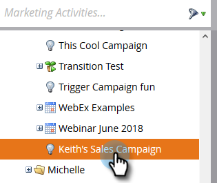
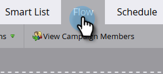

# Gör en marknadsföringskampanj synlig i försäljningsinsikter {#make-a-marketing-campaign-visible-in-sales-insight-actions}

Kampanjer kan bara delas om de är synliga.

Med Sales Insight Actions får användarna tillgång till en ny försäljningsapp som heter toutapp.com. Den här appen ger dem en ny uppsättning åtgärdsfunktioner, men ärver även funktionen _Lägg till i marknadsföringskampanj_ som finns i huvudversionen av försäljningsinsikter. Detta är viktigt att tänka på, eftersom dina Marketo-kampanjer måste konfigureras annorlunda beroende på var du vill att användarna ska få tillgång till funktionen Lägg till i marknadsföringskampanj (toutapp.com eller MSI SFDC-paketupplevelsen). Mer information finns i kommentaren i steg 4.

1. Välj (eller skapa) den kampanj du vill dela.

   

1. Klicka på fliken **Smart lista**.

   

1. Lägg till _Kampanjen är begärd_-utlösare.

   

1. Välj is **Webbtjänstens API** som källa.

   

   >[!NOTE]
   >
   >Om du vill visa marknadsföringskampanjen för användare som använder _Lägg till i marknadsföringskampanj_ från webbappen toutapp.com (detta gäller även om du har webbappen inbäddad i CRM via Marketo Sales Outbox-objektet), anger du den begärda källan för Campaign till&quot;Web Service API&quot;. Om du vill att marknadsföringskampanjen ska visas när en användare använder åtgärderna på MSI-panelen i Salesforce på lead-, kontakt-, konto- eller gruppåtgärdsknapparna på lead- och kontaktlistorna, uppdaterar du den begärda källan för Campaign till&quot;Sales Insight&quot;

1. Klicka på fliken **Flöde**.

   

1. Lägg till flödesåtgärden _Intressant stund_.

   

1. Välj **Webb** som Typ.

   

1. Skriv ett meddelande till ditt säljteam i rutan _Beskrivning_. I det här exemplet använder vi tokens för att ange formuläret som fylldes i.

   

1. Klicka på fliken **Schema** och **Aktivera** kampanjen.

   
