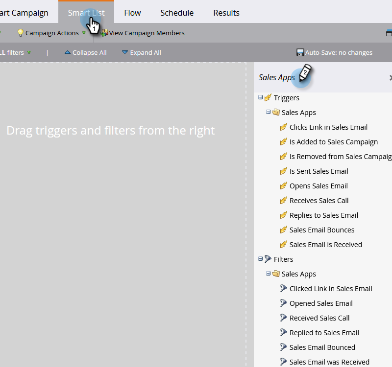

# Utlösare och filter för försäljningsaktivitet {#sales-activity-triggers-and-filters}

Om ni vill samordna interaktionen med säljarna bättre eller försöka få en bättre bild av hur de interagerar med kunderna under hela kundresan, kommer insikterna om försäljningsaktiviteter i Marketo att vara användbara för er.

Följ stegen nedan för att lära dig hur du använder filter för försäljningsaktivitet och utlösare i smarta kampanjer.

1. Hitta och välj den smarta kampanj du vill använda.

   

1. I **Smart List** sök i&quot;Sales Apps&quot;.

   

1. Markera och dra över önskat filter eller utlösare.

   

1. Välj eventuella begränsningar.

   

>[!NOTE]
>
>En fullständig lista över aktiviteter, begränsningar och definitioner finns i [Aktivitetsordlista för Sales Insight Actions](/help/marketo/product-docs/marketo-sales-insight/actions/marketo/sales-insight-actions-activity-glossary.md).
