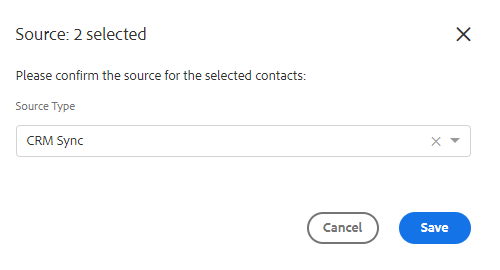

# Massåtgärder för personer {#bulk-actions-on-people}

Det finns några saker du kan göra med dina kontakter i grupp för att spara tid.

Det första steget för alla tillgängliga gruppåtgärder är att markera två eller flera kontakter och klicka på punkten (tre lodräta punkter).

## Lägg till personer i grupp {#add-people-to-group}

Lägg till flera personer i en grupp samtidigt.

## Källa {#source}

Vi tilldelar automatiskt en källa till varje kontakt som matas in i databasen. Använd det här steget för att uppdatera källan.

>[!NOTE]
>
>Källor är inte anpassningsbara.

## Behörighet {#authorization}

I enlighet med [GDPR](https://eugdpr.org/)använder du behörigheten för att ange hur du fick behörighet att interagera med dessa kontakter.

## Avbeställ {#unsubscribe}

Avbeställ massutskick av kontakter som inte längre vill få meddelanden från dig.

## Ta bort {#delete}

Ta bort flera kontakter samtidigt. Fullständiga steg finns [här](/help/marketo/product-docs/marketo-sales-insight/actions/people/managing-contacts/creating-and-deleting-contacts.md).

