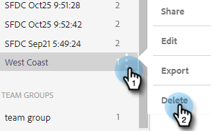
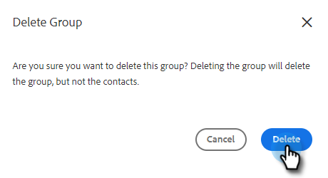

# Hantera grupper {#manage-groups}

Lär dig hantera dina grupper i [!DNL Sales Insight Actions].

## Grupptyper {#group-types}

<table>
 <colgroup>
  <col>
  <col>
 </colgroup>
 <tbody>
  <tr>
   <th>Grupp</th>
   <th>Beskrivning</th>
  </tr>
  <tr>
   <td>[!UICONTROL All People]</td>
   <td>Alla kontakter från alla användare som är synliga för dig.</td>
  </tr>
  <tr>
   <td>[!UICONTROL Dynamic Groups]</td>
   <td>Mina kontakter: Alla kontakter du äger. Avbeställ: Kontakter som har avanmält sig från att ta emot korrespondens.</td>
  </tr>
  <tr>
   <td>[!UICONTROL My Groups]</td>
   <td>Grupper som du har skapat. De kan innehålla dina kontakter eller kontakter som har delats med dig.</td>
  </tr>
  <tr>
   <td>[!UICONTROL Team Groups]</td>
   <td>Grupper som har delats med och/eller av dig. De kan innehålla kontakter som dina teamkamrater äger eller kontakter som du har delat med dem.</td>
  </tr>
 </tbody>
</table>

## Skapa en grupp {#create-a-group}

1. Klicka på [!UICONTROL People]+**bredvid** på sidan [!UICONTROL Groups].

   

1. Namnge gruppen och klicka på **[!UICONTROL Create]**.

   

   Så ja!

## Lägg till kontakter i en grupp {#add-contacts-to-a-group}

1. Under _Grupper_ väljer du **Alla personer**.

   

1. Sök efter personen eller personerna som du vill lägga till.

   

1. Markera kryssrutan bredvid deras namn för att markera dem.

   

1. Klicka på ikonen för fler åtgärder () och välj **Lägg till personer i grupp**.

   

1. Markera gruppen som du vill lägga till dem i och klicka på **Lägg till**.

   

## Dela en grupp {#share-a-group}

1. På sidan [!UICONTROL People] söker du efter och markerar gruppen som du vill dela.

   

1. Klicka på punkten (tre lodräta punkter) och välj **[!UICONTROL Share]**.

   

1. Klicka på listrutan, välj det team som du vill dela gruppen med och klicka på **[!UICONTROL Share]**.

   

   Du äger fortfarande gruppen, men den visas nu under _Team Groups_.

## Ta bort delning av en grupp {#unshare-a-group}

1. På sidan [!UICONTROL People] söker du efter och markerar gruppen som du vill ta bort delningen för.

   

1. Klicka på punkten (tre lodräta punkter) och välj **[!UICONTROL Share]**.

   

1. Klicka på **X** bredvid det team du delade gruppen med och klicka sedan utanför det modala.

   

   Gruppen delas inte.

## Byta namn på en grupp {#rename-a-group}

1. På sidan [!UICONTROL People] söker du efter och markerar gruppen som du vill byta namn på.

   

1. Klicka på punkten (tre lodräta punkter) och välj **[!UICONTROL Edit]**.

   

1. Skriv det nya namnet och klicka på **[!UICONTROL Save]**.

   

## Ta bort en grupp {#delete-a-group}

1. På sidan Personer söker du efter och markerar gruppen som du vill ta bort.

   

1. Klicka på punkten (tre lodräta punkter) och välj **[!UICONTROL Delete]**.

   

1. Bekräfta genom att klicka på **[!UICONTROL Delete]**.

   
