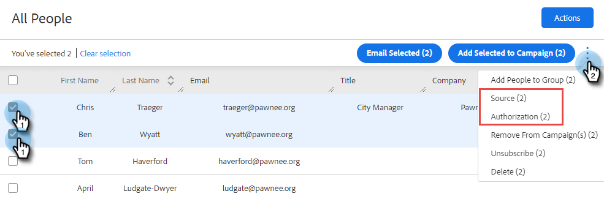
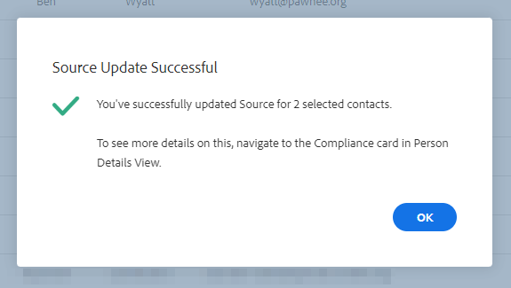

# Försäljningsåtgärder och GDPR-efterlevnad {#sales-insight-actions-and-gdpr-compliance}

Den allmänna dataskyddsförordningen (GDPR) är EU-lagstiftning som trädde i kraft den 25 maj 2018.

## Översikt {#overview}

Syftet är att stärka de registrerades rättigheter inom Europeiska unionen (EU) och Europeiska ekonomiska samarbetsområdet (EES) när det gäller hur deras personuppgifter används och skyddas. Med personuppgifter avses alla uppgifter som rör en identifierad eller identifierbar fysisk person.

Den allmänna dataskyddsförordningen är uppbyggd kring sex huvudprinciper (som beskrivs i artikel 5 i lagstiftningen):

1. Öppenhet när det gäller hur data ska användas och vad de ska användas till.
1. Se till att de insamlade uppgifterna endast används för de ändamål som uttryckligen anges vid insamlingen.
1. Begränsa datainsamlingen till vad som är nödvändigt för att uppfylla ändamålet för insamlingen.
1. Säkerställa att data är korrekta.
1. Lagra uppgifterna endast så länge som det är nödvändigt inom det avsedda ändamålet.
1. Förebygga obehörig användning eller oavsiktlig förlust av data genom att vidta lämpliga säkerhetsåtgärder.

Dessutom finns det ett nytt krav på ansvarighet för att kunna visa hur regelefterlevnaden hanteras och spåras. Detta innebär att man måste föra register över hur och varför personuppgifter samlades in samt dokumentation om de processer som införts för att skydda dem.

## Till vem gäller det? {#to-whom-does-it-apply}

Den allmänna dataskyddsförordningen gäller alla organisationer inom eller utanför EU som marknadsför varor eller tjänster till och/eller spårar beteenden hos registrerade inom EU och EES. Om ni gör affärer med registrerade i Europa som innefattar behandling av deras personuppgifter, gäller denna lagstiftning er. Påföljder för bristande efterlevnad är betydande, med stora böter för dem som bryter mot förordningen. Det högsta bötesbeloppet för en enskild överträdelse är 20 miljoner euro eller 4 % av den globala omsättningen, beroende på vilket belopp som är högst.

## Konsekvenser för marknadsföring {#implications-for-marketing}

Marknadsförarna vill skapa kundupplevelser som känns personliga och mänskliga, bygger på förtroende och levereras med omsorg. Även om den allmänna dataskyddsförordningen inte använder dessa villkor är målen desamma - att respektera kundernas rättigheter och att bygga upp deras förtroende. För att bygga upp och upprätthålla detta förtroende måste marknadsförarna ägna sig åt hur, när och varför deras kunder vill bli engagerade. Det är viktigt att kundens preferenser respekteras, inte bara som ett juridiskt krav, utan som grund för kundfokuserade engagemangsrutiner.

Hur marknadsförarna tillgodoser dessa högre förväntningar när det gäller insamling, användning och säkerhet av personuppgifter som används regelbundet i arbetet är avgörande, och Marketo kan bidra till att uppfylla dessa förväntningar.

Det finns två viktiga aspekter av den allmänna dataskyddsförordningen där marknadsförarna måste granska tidigare, nuvarande och framtida praxis. Det första är samtycke från individen att behandla deras personuppgifter, och det andra är ansvar, nämligen att kunna visa hur principerna i den allmänna dataskyddsförordningen följs.

Vi tillhandahåller omfattande information om samtycke och ansvar inom Marketo-plattformen i vår e-bok, [GDPR och marknadsföraren](https://www.marketo.com/ebooks/the-gdpr-and-the-marketer/). I den här artikeln kommer vi dock att särskilt fokusera på de nya funktionerna i Sales Insight Actions som kommer att hjälpa er organisation att följa GDPR-reglerna.

## GDPR-kompatibilitet vid försäljningsinsiktsåtgärder {#gdpr-compliance-in-marketo-sales-connect}

Sales Insight Actions är en kraftfull applikation - en del av Marketo Engagement Platform - som ger ett enda arbetsflöde och en vy för försäljning och marknadsföring som tillsammans driver utvecklingen snabbare genom samarbete. Ny funktionalitet i Sales Insight Actions har skapats specifikt med GDPR i åtanke. Vi kommer att ge en översikt över alla tre funktionerna och förklara hur de, när de används på rätt sätt, kommer att hjälpa er organisations arbete med GDPR-efterlevnad.

## Kompatibilitetskort {#compliance-card}

Sales Insight Actions innehåller ett efterlevnadskort i personinformationsvyn för att tillhandahålla viktig information om en kontakts auktoriseringstyp samt källtyp. På så sätt kan användarna enkelt lägga till och spåra information som är viktig för datasekretessen och hjälpa dem att fatta mer välgrundade beslut om kampanj-/utåtstrategin.

**Kontaktauktoriseringstyp**

På efterlevnadskortet kan användare spåra den rättsliga grunden för att behandla en kontakts personuppgifter via listrutan för auktorisering. Genom att förstå en kontakts auktoriseringstyp kan användare av Sales Insight Actions fatta mer välgrundade beslut om utåtriktad praxis, vilket säkerställer att varje kampanj eller engagemang är lagligt och lämpligt.

Det finns många alternativ att välja bland:

* Godkännande
* Legitimalt intresse
* Kontraktets utförande
* Efterlevnad av lagstadgade skyldigheter
* Skydd av viktiga intressen
* Offentligt intresse/offentlig myndighet
* Övrigt

**Typ av kontaktkälla**

I det nya efterlevnadskortet kan användarna spåra kontaktens källa. Källtypen definierar varifrån en kontakts information kom när den först överfördes till Sales Insight Actions. Att förstå en kontakts källtyp hjälper också till med beslut om utåtriktad praxis, liksom att fastställa vilka andra system eller platser som personuppgifter lagras, så att varje engagemang överensstämmer med GDPR-lagstiftningen.

Återigen har användarna flera olika alternativ att välja mellan:

* CRM-synkronisering
* Importera
* Manuell överföring
* Kromtillägg
* Övrigt

**Redigera efterlevnadskortet**

När persondetaljvyn är öppen klickar du på **Redigera** i efterlevnadskortet.

Du kommer att se två listrutor: Auktoriseringstyp och källtyp.

Om du väljer&quot;Godkännande&quot; som auktoriseringstyp, två obligatoriska fält: &quot;Datum för samtycke&quot; och &quot;syfte med bearbetning&quot; visas. Dessa två fält kan inte användas för andra alternativ.

Om du väljer &quot;Annat&quot; för antingen Auktoriseringstyp eller Källtyp kan du ange text som beskriver källtypen.

**Massåtgärder**

Sales Insight Actions gör det även möjligt att uppdatera en kontakts Authorization och Source-typer i grupp, vilket sparar värdefull tid i efterlevnadsprocessen.

När du väljer en eller flera kontakter på personsidan visas en punkt (tre punktmeny) till höger. Klicka på det så ser du alternativen Authorization och Source är. Du kan ange auktorisering eller källa för flera kontakter samtidigt.

När du klickar på spärren för auktorisering visas ett popup-fönster med alternativ som matchar alternativen i efterlevnadskortet.

När auktoriseringstypen har uppdaterats får du ett bekräftelsemeddelande och du kan se den uppdaterade informationen på efterlevnadskortet i personinformationsvyn.

På samma sätt kan källtypen också uppdateras gruppvis genom att du klickar på källmodalen.

När du har valt rätt källtyp för de valda kontakterna visas ett bekräftelsefönster som bekräftar att uppdateringen lyckades.

## Exportera kontaktdata från försäljningsåtgärder {#exporting-contact-data-from-marketo-sales-connect}

Du kan exportera kontaktinformation från persondetaljvyn. Vid export hämtas en CSV-fil med följande kolumner:

<table> 
 <colgroup> 
  <col> 
  <col> 
  <col> 
 </colgroup> 
 <tbody> 
  <tr> 
   <td>Förnamn</td> 
   <td>Webbplats</td> 
   <td>Facebook</td> 
  </tr> 
  <tr> 
   <td>Efternamn</td> 
   <td>Övrigt</td> 
   <td>Twitter</td> 
  </tr> 
  <tr> 
   <td>Företag</td> 
   <td>Uppdaterat den</td> 
   <td>LinkedIn</td> 
  </tr> 
  <tr> 
   <td>Titel</td> 
   <td>Skapad den</td> 
   <td>Exporterad den</td> 
  </tr> 
  <tr> 
   <td>E-post-ID</td> 
   <td>Salesforce-ID</td> 
   <td> </td> 
  </tr> 
  <tr> 
   <td>Telefonnummer</td> 
   <td>Person-ID</td> 
   <td> </td> 
  </tr> 
 </tbody> 
</table>

>[!NOTE]
>
>Detta kan bara göras en kontakt i taget. Det finns för närvarande ingen funktion som tillåter bulkexport av kontakter.

Om du vill exportera kontaktinformation klickar du på de tre lodräta prickarna i sidhuvudet i persondetaljvyn och väljer **Exportera**. .CSV-filen hämtas automatiskt.

>[!NOTE]
>
>GDPR kräver också att du kan ta bort kontakter från användargränssnittet, men Sales Insight Actions har redan den funktionen.

## Avbeställ {#unsubscribes}

Ett vanligt missförstått område i GDPR är kontakter som avslutar prenumerationen på organisationens databas. För att följa nya regler om skydd av data för dem som väljer att säga upp prenumerationen har följande funktioner inkluderats i Sales Insight Actions:

**Avbeställ länkar:** Länkar för att avbryta prenumerationen läggs automatiskt till i alla e-postmeddelanden som skickas från webbprogrammet Sales Connect för att säkerställa att kontakterna kan avanmäla sig.\
**Avbeställ synkronisering:** Användare kan synkronisera avanmälan till och från sina CRM (Salesforce) för att säkerställa att avanmälningarna är aktuella.\
**Avbeställningshistorik:** Användare kan se tidigare avanmälan och avanmälan i persondetaljvyn.\
**Avbeställ borttagning:** Om du väljer att avbryta prenumerationen i måste användaren ha administratörsbehörighet och visa att kontakten har gett nytt medgivande för att kunna kontakta dem.

## Framtida uppdateringar {#future-updates}

Som en entusiastisk förespråkare för engagemangsekonomins styrka och kundfokus förstår Marketo vikten av att den registrerade får ta hand om integritetsskydd och dataskydd. Precis som med andra dataskyddslagar kräver GDPR-efterlevnad engagemang från både Marketo och våra kunder. Den här artikeln är avsedd att hjälpa er att använda Marketo på ett lämpligt sätt för att stödja er organisations GDPR-efterlevnad.

Vi kommer att fortsätta att noggrant följa GDPR-riktlinjer som utfärdats av tillsynsmyndigheter och tillhörande lagstiftning. Uppdateringar kommer att läggas upp på vårt Trust Center på [trust.marketo.com](https://trust.marketo.com).
