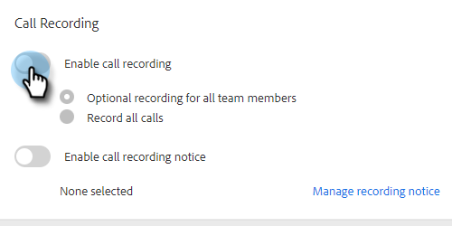

# Aktivera samtalsinspelning {#enable-call-recording}

Som administratör kan du aktivera samtalsinspelning för dina [!DNL Sales Insight Actions] samtal. Att spela in samtalet i teamet kan vara ett bra sätt att lära säljarna de bästa samtalsrutinerna.

1. Klicka på ikonen Inställningar och välj **[!UICONTROL Settings]**.

   

1. Klicka på [!UICONTROL Admin Settings] under **[!UICONTROL Dialer]**.

   

1. Välj växlingsknappen **[!UICONTROL Enable call recording]**.

   

1. Om du vill ge dina säljare möjlighet att aktivera eller inaktivera samtalsinspelning klickar du på **[!UICONTROL Optional recording for all team members]**. Om du vill att alla samtal ska spelas in automatiskt klickar du på **[!UICONTROL Record all calls]**.

   

>[!MORELIKETHIS]
>
>[Inställningar för dubbelpartsgodkännande](/help/marketo/product-docs/marketo-sales-insight/actions/phone/two-party-consent-settings.md)
