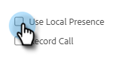

# Lokal närvaro {#local-presence}

Med Lokal närvaro kan du få det att se ut som om du ringer från mottagarens riktnummer.

## Välj lokal närvaro {#select-local-presence}

1. Klicka på telefonikonen för att öppna återförsäljaren.

   

1. Markera kryssrutan **[!UICONTROL Use Local Presence]**.

   

## Vanliga frågor och svar {#faq}

**Kan min kontakt ringa upp mig på det här nya numret?**

Nej, lokal närvaro fungerar bara för utgående samtal. Anroparen kan inte ringa tillbaka till det här&quot;nya&quot; numret.

**Kan jag ringa var som helst med lokal närvaro?**

Vi erbjuder all telefonfunktionalitet för försäljning endast i USA.

**Är det lokala närvaronumret alltid detsamma när jag anropar en riktnummer?**

Talet är troligtvis alltid detsamma när du anropar en riktnummer.

**Ändrar hela mitt nummer eller bara riktnumret när jag använder lokal närvaro?**

Hela ditt nummer ändras.
