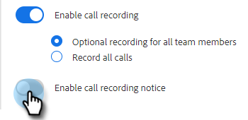

# Inställningar för dubbelpartsgodkännande {#two-party-consent-settings}

För att säkerställa att USA:s tvåpartslagar följs när du spelar in samtal kan du som administratör aktivera ett inspelat meddelande som du väljer att spela upp i början av dina samtal när det spelas in.

>[!PREREQUISITES]
>
>Innan du följer stegen nedan måste du först [aktivera samtalsinspelning](/help/marketo/product-docs/marketo-sales-insight/actions/phone/enable-call-recording.md).

1. Klicka på ikonen Inställningar och välj **[!UICONTROL Settings]**.

   

1. Klicka på [!UICONTROL Admin Settings] under **[!UICONTROL General]**.

   

1. Klicka på [!UICONTROL Call Recording] på **[!UICONTROL Manage recording notice]**-kortet.

   

1. Klicka på **[!UICONTROL Import Recording]**.

   

   >[!NOTE]
   >
   >Endast Wav- och MP3-filer stöds. Du kan inte överföra en fil som är längre än 30 sekunder.

1. Välj önskad ljudfil(er) på hårddisken.

   

1. När överföringen är klar väljer du docka (tre punkter) i filhanteraren och klickar på **[!UICONTROL Select as Consent Notice]**. Klicka på **[!UICONTROL OK]** när du är klar.

   

1. Klicka på växlingsknappen för att aktivera att det markerade meddelandet spelas upp i början av dina inspelade samtal.

   
