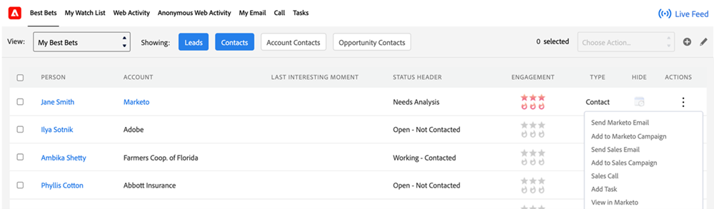
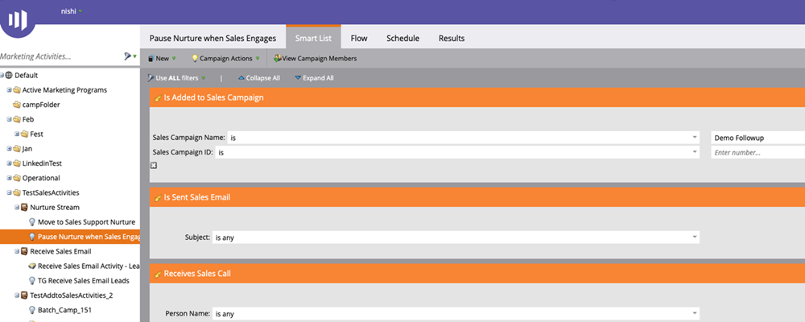

# Funktionsöversikt för Sales Insight {#msi-actions-feature-overview}

Snabba upp prospekteringsarbetet med marknadsföringsstyrda verktyg för analys och engagemang i ett enda arbetsflöde med Sales Insight Actions.

>[!AVAILABILITY]
>
>Den här funktionen är för närvarande begränsad för GA. Kontakta din Customer Success Manager eller mejl `sales-insights(at)adobe(dot)com` för att begära åtkomst.

## Leadlayout och kontaktlayout {#lead-layout-and-contact-layout}

Följande åtgärder är tillgängliga i listrutan Välj åtgärder i det övre navigeringsfältet:

* Skicka e-postmeddelande
   * E-postmeddelanden med försäljningsmeddelanden har vy, klickning och svarsspårning (när leveranskanalen är inställd)
   * Inkluderar e-post-Personalization, anpassad signatur och bilagor
   * Malldelning och rapporter
   * Teamdelning, gruppmeddelanden och CC/BCC-funktioner
   * E-postaktiviteten för försäljning loggas i Marketo personpost
   * Motsvarande filter och utlösare i Marketo Smart Campaigns (se informationen nedan)

* Lägg till i försäljningskampanj
   * Lägg till leads till säljspelböcker som är en sekvens av e-postmeddelanden och uppgifter
   * Inkluderar teamåtkomst och delning, uppgiftsgenerering, hoppar över helger, ignorerar OO-e-post som svar samt automatisk avslutning
   * Kampanjaktiviteten loggas i Marketo personpost
   * Motsvarande filter och utlösare i Marketo Smart Campaigns (se informationen nedan)

* Försäljningsnummer
   * Ring säljsamtal med återförsäljaren i CRM
   * Inkluderar lokal närvaro, inspelad i förväg
   * Logga samtalsresultat, samtalsinspelning på panelen och aktivitetshistorik
   * Samtalsaktiviteten loggas i Marketo personpost
   * Filter och utlösare i Marketo Smart Campaigns

* Lägg till uppgift
   * Skapa e-post, samtal, InMail och anpassade uppgifter för dina leads
   * Automatisera skapande av uppgifter med säljkampanjer
   * Synkronisera uppgifter med Salesforce
   * Logga uppgifter i avsnittet Aktivitetshistorik i Salesforce

Du kommer åt Live Feed genom att klicka på ikonen ((0)) i det övre navigeringsfältet. Den innehåller funktioner för live-uppdateringar av försäljningsaktiviteter samt möjlighet att docka skärmen.

Följande data är tillgängliga på flikarna på MSI-panelen:

* Instrumentpanel för insikter
   * Hastighetsstödrastret för engagemang kommer att innehålla aktiviteter från säljmeddelanden, säljkampanjer och säljare
   * Kommande försäljningskampanjer - När en lead är en del av en pågående kampanj är den här informationen tillgänglig på fliken för kommande försäljningskampanjer
   * Kommande uppgifter - När det finns en kommande uppgift som gäller en lead är den här informationen tillgänglig på fliken Kommande uppgifter

* Fliken E-post
   * Alla skickade e-postmeddelanden loggas här. Aktiviteterna loggas även i Marketo personpost
   * Kolumnerna innehåller Ämne, Öppen, Klicka, Besvarad (endast tillgängligt för e-post med leveranskanalinställningar), Avsändare, Datum
   * Inkluderar utfällbara kort med ytterligare information som avsändare, mall, försäljningskampanj och e-post för förhandsgranskning

* Fliken Ring
   * Alla samtal som läggs med hjälp av försäljningsfunktionen loggas här. Aktiviteterna loggas även i Marketo personpost
   * Kolumnerna innehåller namn, resultat, anteckningar, Anropat, Varaktighet och länka till inspelning
   * Inkluderar utskjutningskort med ytterligare information som Samtal gjort av, Samtal besvarat av, Telefonnummer och Status

## Konto- och säljprojektslayout {#account-and-opportunity-layout}

Följande åtgärder är tillgängliga i den övre navigeringen:

* Skicka e-post för försäljning - möjlighet att skicka personaliserade eller mallsidiga gruppmeddelanden med vy, klickning och svarsuppföljning till alla kontakter som är kopplade till ett konto/en affärsmöjlighet
   * E-postmeddelanden med försäljningsmeddelanden har vy, klickning och svarsspårning (när leveranskanalen är inställd)
   * Inkluderar e-post-Personalization, anpassad signatur och bilagor
   * Malldelning och rapporter
   * Teamdelning, gruppmeddelanden och CC/BCC-funktioner
   * E-postaktiviteten för försäljning loggas i Marketo personpost
   * Motsvarande filter och utlösare i Marketo Smart Campaigns (se informationen nedan)

* Lägg till i Försäljningskampanj - Lägg till alla kontakter som är kopplade till ett konto/en affärsmöjlighet i säljspelsböcker som är en sekvens av e-postmeddelanden och uppgifter
   * Lägg till leads till säljspelböcker som är en sekvens av e-postmeddelanden och uppgifter
   * Inkluderar teamåtkomst och delning, uppgiftsgenerering, hoppar över helger, ignorerar OO-e-post som svar samt automatisk avslutning
   * Kampanjaktiviteten loggas i Marketo personpost
   * Motsvarande filter och utlösare i Marketo Smart Campaigns (se informationen nedan)

Du kommer åt Live Feed genom att klicka på ikonen ((0)) i det övre navigeringsfältet. Den innehåller funktioner för live-uppdateringar av försäljningsaktiviteter samt möjlighet att docka skärmen.

Följande data är tillgängliga på flikarna:

* Instrumentpanel för insikter
   * Hastighetsstödrastret för engagemang kommer att innehålla aktiviteter från säljmeddelanden, säljkampanjer och försäljningskampanjåtgärder
   * Kommande försäljningskampanjer - När en kontakt från kontot/affärsmöjligheten är en del av en pågående kampanj är den här informationen tillgänglig på fliken för kommande försäljningskampanjer
   * Kommande uppgifter - När det finns en kommande uppgift som gäller en kontakt från kontot/affärsmöjligheten är den här informationen tillgänglig på fliken Kommande uppgifter

* Fliken E-post
   * Alla e-postmeddelanden som skickas till kontakter från kontot/affärsmöjligheten loggas här. Aktiviteterna loggas även i Marketo personpost
   * Kolumnerna innehåller Ämne, Öppen, Klicka, Besvarad (endast tillgängligt för e-post med leveranskanal inställd), Avsändare och Datum
   * Inkluderar utfällbara kort med ytterligare information som avsändare, mall, försäljningskampanj och e-post för förhandsgranskning

* Fliken Ring
   * Alla samtal som görs till kontakter från kontot/affärsmöjligheten med hjälp av försäljningsfunktionen loggas här. Aktiviteterna loggas även i Marketo personpost
   * Kolumnerna innehåller namn, resultat, anteckningar, Anropat, Varaktighet och länk till inspelning
   * Inkluderar utskjutningskort med ytterligare information som Samtal gjort av, Samtal besvarat av, Telefonnummer och Status

## Lead- och kontaktlistvy (massåtgärder) {#lead-and-contact-list-view}

* Skicka e-post för försäljning - möjlighet att skicka personaliserade eller mallsidiga e-postmeddelanden med vy, klicka och svara på spårning till en lista över kontakter/leads
* Skicka säljkampanj - Lägg till i säljspelsböcker som är en sekvens med e-postmeddelanden och uppgifter i en lista med kontakter/leads

## Marketo Global Tab {#marketo-global-tab}

**Fliken Bästa val**

Följande gruppåtgärder är tillgängliga i listrutan på fliken Bästa val:

* Skicka e-post för försäljning - möjlighet att skicka personaliserade eller mallsidiga e-postmeddelanden med visning, klickning och svarsuppföljning
* Skicka säljkampanj - Lägg till leads till säljspelsböcker som är en sekvens av e-postmeddelanden och uppgifter

   

Följande textbundna åtgärder är tillgängliga för enskilda leads/kontakter på fliken Bästa val:

* Skicka e-post för försäljning - möjlighet att skicka personaliserade eller mallsidiga e-postmeddelanden med visning, klickning och svarsuppföljning
* Skicka säljkampanj - Lägg till leads till säljspelsböcker som är en sekvens av e-postmeddelanden och uppgifter
* Säljare - ringa försäljningssamtal med återförsäljaren i CRM
* Lägg till aktivitet - Skapa e-post, samtal, kund- eller länkade aktiviteter för potentiella leads

   

**Fliken E-post**

* Alla skickade e-postmeddelanden loggas här. Aktiviteterna loggas även i Marketo personpost
* Kolumnerna innehåller Ämne, Öppen, Klicka, Besvarad (endast tillgängligt för e-post med leveranskanal inställd), Avsändare och Datum
* Inkluderar utfällbara kort med ytterligare information som avsändare, mall, försäljningskampanj och e-post för förhandsgranskning

**Fliken Ring**

* Alla samtal som läggs med hjälp av försäljningsfunktionen loggas här. Aktiviteterna loggas även i Marketo personpost
* Kolumnerna innehåller namn, resultat, anteckningar, Anropat, Varaktighet och länk till inspelning
* Inkluderar utskjutningskort med ytterligare information som Samtal gjort av, Samtal besvarat av, Telefonnummer och Status

**Fliken Aktivitet**

* E-post, Samtal, InMail och Anpassade uppgifter som skapats och slutförts är tillgängliga för uppgiftshantering på den här fliken. Inkluderar möjlighet att lägga till aktivitet
* Automatisera skapande av uppgifter med säljkampanjer
* Synkronisera uppgifter med Salesforce
* Logga uppgifter i avsnittet Aktivitetshistorik i Salesforce

   

**Live-feed**

* Möjlighet att se live-uppdateringar om försäljningsaktiviteter tillsammans med skärmdockning
* Inbäddade knappar för e-post, samtal och cadence gör att alla kundinsikter kan hanteras

## Funktioner i Marketo {#features-available-in-marketo}

Försäljningsaktiviteter som ingår i Marketo:

* Skicka e-post för försäljning - Användaren skickade ett e-postmeddelande till en lead
* Öppna e-postmeddelande - Lead öppnade ett e-postmeddelande
* Klicka på E-post för försäljning - Lead klickade på en länk i ett e-postmeddelande
* Svara e-post - Lead svarade på ett e-postmeddelande
* Ta emot försäljningssamtal - Lead tog emot ett samtal från en säljare med hjälp av försäljningsnumret.
* Lägg till i försäljningskampanj - Lead har lagts till i en försäljningskampanj som skapats
* Borttagen från försäljningskampanj - Lead har tagits bort från en försäljningskampanj som skapats

Filter och utlösare är:

* Skicka e-postmeddelande
* Öppen e-postadress
* Klicka på E-postadress för försäljning
* Svar på e-postadress
* Mottaget försäljningssamtal
* Tillagd i försäljningskampanj
* Borttagen från försäljningskampanj

   
