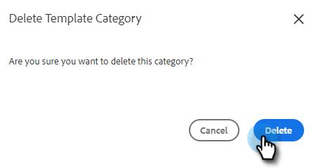

# Hantera mallkategorier {#manage-template-categories}

## Skapa en kategori {#create-a-category}

1. Klicka på fliken **[!UICONTROL Templates]**.

   

1. Klicka på ikonen **+** bredvid **[!UICONTROL Categories]**.

   

1. Ange ett namn för den nya kategorin och klicka sedan på **[!UICONTROL Create]**.

   

## Byta namn på en mallkategori {#rename-a-template-category}

1. Klicka på fliken **[!UICONTROL Templates]**.

   

1. Håll pekaren över mallen som du vill byta namn på och klicka på punkten (tre punkter). Välj **[!UICONTROL Rename]**.

   

1. Skriv in det nya namnet. Tryck på Enter (eller klicka någon annanstans på skärmen) för att spara.

   

## Ta bort en mallkategori {#delete-a-template-category}

1. Klicka på fliken **[!UICONTROL Templates]**.

   

1. Håll pekaren över mallen som du vill byta namn på och klicka på punkten (tre punkter). Välj **[!UICONTROL Delete]**.

   

1. Bekräfta genom att klicka på **[!UICONTROL Delete]**.

   

>[!NOTE]
>
>Kategorier kan inte tas bort om de innehåller mallar. Flytta eller ta bort alla mallar innan du tar bort en kategori.
