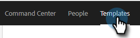

# Hantera mallkategorier {#manage-template-categories}

## Skapa en kategori {#create-a-category}

1. Klicka på **Mallar** -fliken.

   

1. Klicka på **+** ikon bredvid **Kategorier**.

   

1. Ange ett namn för den nya kategorin och klicka sedan på **Skapa**.

   

## Byta namn på en mallkategori {#rename-a-template-category}

1. Klicka på **Mallar** -fliken.

   

1. Håll pekaren över mallen som du vill byta namn på och klicka på punkten (tre punkter). Välj **Byt namn**.

   

1. Skriv in det nya namnet. Tryck på Enter (eller klicka någon annanstans på skärmen) för att spara.

   

## Ta bort en mallkategori {#delete-a-template-category}

1. Klicka på **Mallar** -fliken.

   

1. Håll pekaren över mallen som du vill byta namn på och klicka på punkten (tre punkter). Välj **Ta bort**.

   

1. Klicka **Ta bort** för att bekräfta.

   

>[!NOTE]
>
>Kategorier kan inte tas bort om de innehåller mallar. Flytta eller ta bort alla mallar innan du tar bort en kategori.
