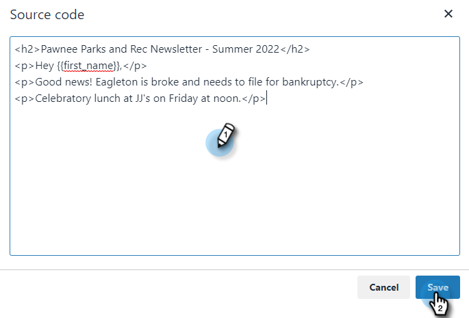

# Använda HTML {#using-html}

1. Kopiera källkoden från dina e-postmeddelanden i det verktyg du använder för att skapa e-postmeddelanden i HTML (t.ex. Marketo e-postredigerare).

1. Välj den mall som du vill lägga till HTML i.

   

1. Klicka på **Redigera**.

   

1. Klicka på **Källa** i mallredigeraren.

   

1. Klistra in källkoden och klicka **Spara**.

   

>[!NOTE]
>
>Om du får felmeddelandet &quot;Error - to remove the style/java/html tags&quot; betyder det att du har en formatering som vi inte stöder. Du bör söka efter ordstilen i källkoden och ta bort allt från ``.
