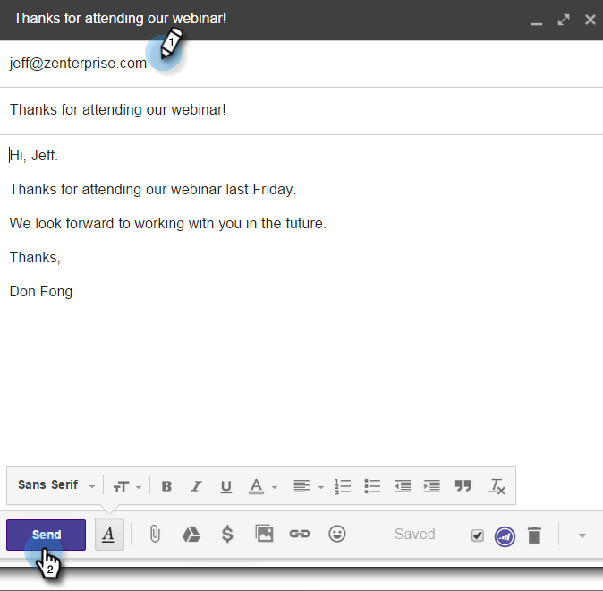

# Using Marketo Insights for Google Chrome {#using-marketo-insights-for-google-chrome}

Skicka och spåra alla Google-e-postmeddelanden med Marketo Insights för Google Chrome.

>[!NOTE]
>
>**Förutsättningar**
>
>* [Installera Marketo Insights för Google Chrome](install-marketo-insights-for-google-chrome.md)

>

## Skicka ett e-postmeddelande med Marketo Insights {#send-an-email-with-marketo-insights}

1. I fönstret Disponera klickar du på ikonen Marketo.

   

1. Knappen Skicka har gjort Markto lila! Det här e-postmeddelandet skickas nu med Marketo, alla länkar spåras och en spårningspixel infogas i e-postmeddelandet. Detta registreras som en skickad e-postaktivitet.

   

   >[!NOTE]
   >
   >Med en spårningspixel vet du vem som öppnade e-postmeddelandet.

   >[!TIP]
   >
   >Du kan även klicka på dubbelpilen för att expandera till helskärmsläge.

1. Om du vill fylla i e-postmeddelandet i förväg med en publicerad Marketo-mall klickar du på **Fler alternativ** och väljer **Läs in Marketo-mall.**

   

1. Välj en **tillgänglig mall** och klicka på **OK.**

   

1. Ange ditt innehåll, en e-postadress och klicka på **Skicka**.

   

   >[!NOTE]
   >
   >Meddelanden spåras bara när knappen **Skicka** är lila.

1. E-postmeddelandet visas snart i Marketo Sales Insight och alla öppningar och klick spåras.

   

## Logga e-postsvar med Marketo {#log-email-replies-with-marketo}

Du kan logga svar och gammal aktivitet i en leads aktivitetshistorik.

1. Klicka på **Logga med Marketo** i förhandsgranskningsfönstret i Google Mail.

   

1. Det är allt! E-postmeddelandet visas snart i Marketo Sales Insight.

   

   >[!NOTE]
   >
   >**Relaterade artiklar**
   >
   >    
   >    
   >    * [Installera Marketo Insights för Google Chrome](install-marketo-insights-for-google-chrome.md)
   >    * [Visa person- och kontoinformation och aktiviteter i Google Mail](view-person-and-account-information-and-activities-in-google-mail.md)

