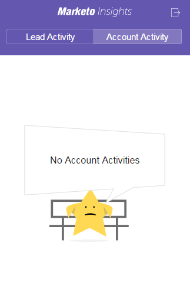

# Visa person- och kontoinformation och aktiviteter i Google Mail {#view-person-and-account-information-and-activities-in-google-mail}

>[!NOTE]
>
>**FYI**
>
>Marketo standardiserar nu språk för alla prenumerationer, så du kan se lead/leads i din prenumeration och person/personer på docs.marketo.com. Dessa termer betyder samma sak. det påverkar inte artikelinstruktionerna. Det finns andra förändringar också. [Läs mer](http://docs.marketo.com/display/DOCS/Updates+to+Marketo+Terminology).

## Visa aktiviteter i Google Mail {#view-activities-in-google-mail}

Använd rutan Sammanhangsbaserade insikter om Marketo för att se kontoinformation och senaste aktiviteter.

Panelen visas både i helskärmsfönstret och som det vanliga läsfönstret för Google Mail. I dispositionsvyn visar rutan information och aktiviteter för den första personen som anges på raden Till. I läsvyn visar rutan information och aktiviteter för den person som skickade e-postmeddelandet du läser till dig.

På fliken Personaktivitet visas relevant information om personen, till exempel namn, titel, bild och så vidare. Du kan även se de senaste aktiviteterna som har inträffat efter att du har skickat ett e-postmeddelande, till exempel besökt en webbsida, fyllt i ett formulär, klickat på en länk, deltagit i ett evenemang och öppnat ett e-postmeddelande.

På fliken Kontoaktivitet visas relevant kontoinformation, t.ex. företagsnamn, webbplatsens URL och plats. På fliken visas även de senaste kontoaktiviteterna. Kontot identifieras av persondomänen. Aktiviteter visas i listan om någon Sales Insight-användare i din prenumeration någonsin har motsvarat dem.

Om ditt team aldrig har utväxlat ett säljmejl med personen visas inga aktiviteter.

Klicka på ikonen för att komprimera rutan.

Klicka på Marketo-ikonen för att expandera rutan.

## Visa aktiviteter i Google Chrome {#view-activities-in-google-chrome}

Du kan också använda rutan Global aktivitet i Google Chrome för att visa en fullständig lista över de senaste aktiviteterna som har inträffat för alla personer som du nyligen har använt. Det här är en uppdatering i realtid som kontinuerligt visar antalet olästa aktiviteter på ikonen.

Klicka på Marketo-ikonen för att öppna rutan.

>[!MORELIKETHIS]
>
>[Using Marketo Insights for Google Chrome](using-marketo-insights-for-google-chrome.md)

