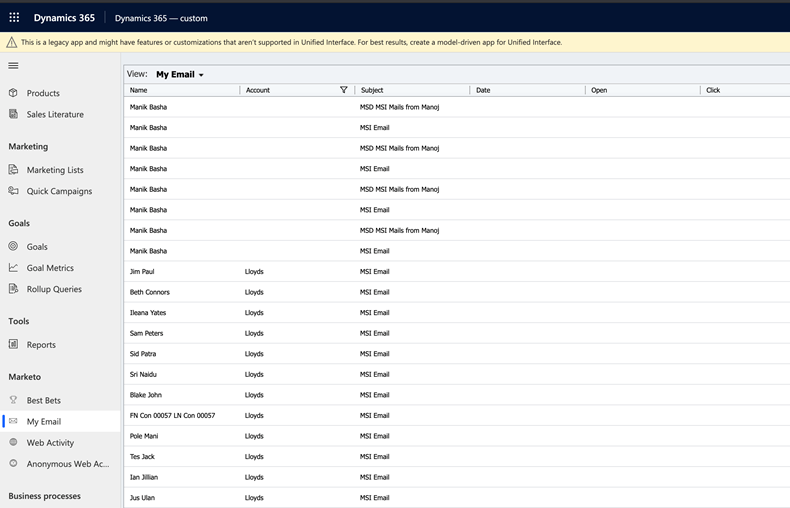

# E-postaktiviteter {#email-activities}

På fliken E-postaktiviteter visas alla e-postmeddelanden som har skickats av Försäljning till leads och kontakter under Säljaren. Granska skickat datum och om e-postmeddelandet öppnades eller klickades av mottagaren.

