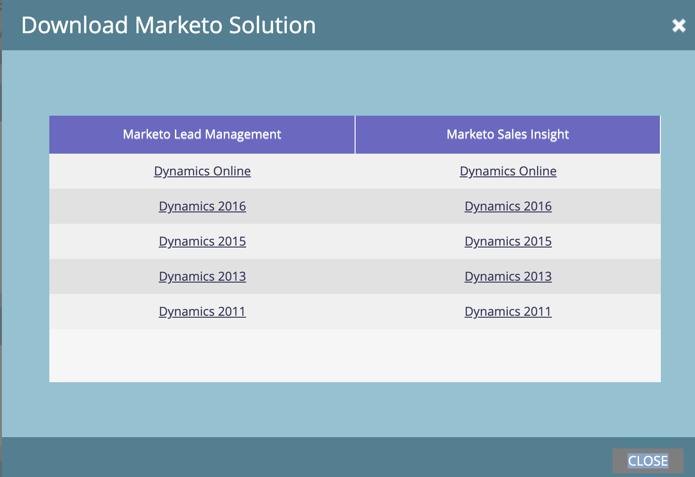

# Hämta Marketo Sales Insight Solution för Microsoft Dynamics {#download-the-marketo-sales-insight-solution-for-microsoft-dynamics}

>[!NOTE]
>
>**Administratörsbehörigheter krävs**

>[!IMPORTANT]
>
>Plugin-programmet på den här sidan är avsett för synkronisering till Marketo Engage med Marketo inbyggda CRM-synkroniseringslösning till Dynamics 365. För dem som har: en anpassad synkronisering, MS Dynamics 365 Online (9.x och senare), och som har köpt Marketo Sales Insight, är [paketet här](https://mktg-cdn.marketo.com/community/MarketoSalesInsight_NonNative.zip){target="_blank"}.

1. Gå till området **Admin**.

   

1. Klicka på **CRM**.

   

1. Välj **Microsoft**.

   

1. Välj **Hämta Marketo-lösning**.

   

1. Välj lämplig lösning för din version av Microsoft Dynamics.

   

Bra! En ZIP-fil med lösningen hämtas till din enhet.
