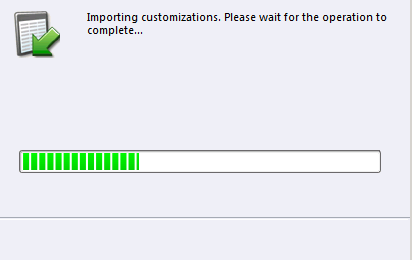
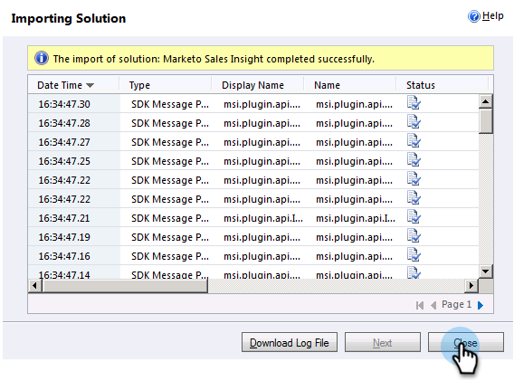

# Installera och konfigurera Marketo Sales Insight i Microsoft Dynamics 2011 {#install-and-configure-marketo-sales-insight-in-microsoft-dynamics}

Marketo Sales Insight är ett fantastiskt verktyg för ert säljteam. Här följer den stegvisa instruktionen om hur du installerar och konfigurerar den i Microsoft Dynamics 2011 On-Premises.

>[!PREREQUISITES]
>
>Komplettera integreringen mellan Marketo och Microsoft.
>
>[Ladda ned rätt lösning](/help/marketo/product-docs/marketo-sales-insight/msi-for-microsoft-dynamics/installing/download-the-marketo-sales-insight-solution-for-microsoft-dynamics.md) för din version av Microsoft Dynamics CRM.

## Importera lösning {#import-solution}

1. Logga in på Microsoft Dynamics CRM. Klicka **Inställningar** i den nedre vänstra menyn.

   

1. Välj **Lösningar** i trädet.

   

1. Klicka **Importera** ( ).

   

   >[!NOTE]
   >
   >Du borde redan ha [installerade och konfigurerade](/help/marketo/product-docs/marketo-sales-insight/msi-for-microsoft-dynamics/installing/install-and-configure-marketo-sales-insight-in-microsoft-dynamics-2011.md) Marketo-lösningen innan du går vidare.

1. Klicka **Bläddra**. Välj den Marketo Sales Insight-lösning du behöver [nedladdad](/help/marketo/product-docs/marketo-sales-insight/msi-for-microsoft-dynamics/installing/download-the-marketo-sales-insight-solution-for-microsoft-dynamics.md). Klicka **Nästa**.

   

1. Verifiera informationen om lösningen och klicka på **Nästa**.

   

1. Kontrollera att alternativet SDK-meddelande är markerat. Klicka **Nästa**.

   

1. Vänta nu tills importen är klar.

   

1. Klicka **Stäng**.

   

1. Marketo Sales Insight visas nu i lösningslistan. Ja!

   

1. Välj Marketo Sales Insight och klicka på **Publicera alla anpassningar** ( ).

   

## Connect Marketo och Sales Insight  {#connect-marketo-and-sales-insight}

>[!NOTE]
>
>**Administratörsbehörigheter krävs**

1. Logga in på Marketo och klicka **Administratör**.

   

1. Under **Försäljningsinsikter** avsnittsklicka **Redigera API-konfiguration**.

   

1. Kopiera **Marketo Host**, **API-URL** och **API-användar-ID** för användning i ett senare steg. Ange en **API-hemlig nyckel** efter eget val och klicka **Spara**.

   >[!CAUTION]
   >
   >Använd inte ett et-tecken (&amp;) i API-hemlig nyckel.

   

   >[!NOTE]
   >
   >Följande fält måste synkroniseras med Marketo för _både lead och kontakt_ för Sales Insight att arbeta:
   >
   >* Prioritet
   >* Akut
   >* Relativa poäng

   >
   >Om något av dessa fält saknas visas ett felmeddelande i Marketo med namnet på de saknade fälten. Åtgärda problemet genom att utföra [detta förfarande](/help/marketo/product-docs/marketo-sales-insight/msi-for-microsoft-dynamics/setting-up-and-using/required-fields-for-syncing-marketo-with-dynamics.md).

1. Gå tillbaka till Dynamics, välj **Inställningar**.

   

1. Välj **Marketo API Config** i trädet.

   

1. Klicka **Standardkonfiguration**.

   

1. Ange den information du tog från Marketo tidigare.

   

1. Klicka **Spara**.

   

## Ange användaråtkomst {#set-user-access}

Konfigurera användarroller för att ge specifika användare åtkomst till Sales Insight.

1. Välj **Inställningar**.

   

1. Välj **Administration** i trädet.

   

1. Klicka **Användare**.

   

1. Markera de användare som du vill ge åtkomst till och klicka på **Hantera roller**.

   

1. Välj **Marketo Sales Insight** roll och klicka **OK**.

   

   Och det är allt! Alla användare har tillgång till det här avsnittet med säljinsikter i vyn för lead-/kontaktinformation.

   

   Grattis. Nu har du släppt loss kraften i Marketo Sales Insight.

>[!MORELIKETHIS]
>
>[Stjärnor och flamma för lead-/kontaktposter](/help/marketo/product-docs/marketo-sales-insight/msi-for-microsoft-dynamics/setting-up-and-using/setting-up-stars-and-flames-for-lead-contact-records.md)
