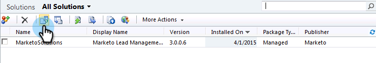
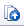

# Installera och konfigurera [!DNL Marketo Sales Insight] i [!DNL Microsoft Dynamics 2011] {#install-and-configure-marketo-sales-insight-in-microsoft-dynamics}

[!DNL Marketo Sales Insight] är ett fantastiskt verktyg för ditt säljteam. Här följer en steg-för-steg-instruktion om hur du installerar och konfigurerar den i [!DNL Microsoft Dynamics 2011] lokal.

>[!PREREQUISITES]
>
>Komplettera integreringen mellan Marketo och Microsoft.
>
>[Hämta rätt lösning](/help/marketo/product-docs/marketo-sales-insight/msi-for-microsoft-dynamics/installing/download-the-marketo-sales-insight-solution-for-microsoft-dynamics.md) för din version av [!DNL Microsoft Dynamics] CRM.

## Importera lösning {#import-solution}

1. Logga in på [!DNL Microsoft Dynamics] CRM. Klicka på **[!UICONTROL Settings]** i den nedre vänstra menyn.

   

1. Välj **[!UICONTROL Solutions]** i trädet.

   

1. Klicka på **Importera** ( ).

   

   >[!NOTE]
   >
   >Du bör redan ha [installerat och konfigurerat](/help/marketo/product-docs/marketo-sales-insight/msi-for-microsoft-dynamics/installing/install-and-configure-marketo-sales-insight-in-microsoft-dynamics-2011.md) Marketo-lösningen innan du går vidare.

1. Klicka på **[!UICONTROL Browse]**. Välj den [!DNL Marketo Sales Insight]-lösning du [hämtade](/help/marketo/product-docs/marketo-sales-insight/msi-for-microsoft-dynamics/installing/download-the-marketo-sales-insight-solution-for-microsoft-dynamics.md). Klicka på **[!UICONTROL Next]**.

   

1. Verifiera informationen om lösningen och klicka på **[!UICONTROL Next]**.

   

1. Kontrollera att meddelandealternativet för SDK är markerat. Klicka på **[!UICONTROL Next]**.

   

1. Vänta nu tills importen är klar.

   

1. Klicka på **[!UICONTROL Close]**.

   

1. [!DNL Marketo Sales Insight] visas nu i lösningslistan. Ja!

   

1. Välj [!DNL Marketo Sales Insight] och klicka på **Publicera alla anpassningar** ( ).

   

## Connect Marketo och Sales Insight  {#connect-marketo-and-sales-insight}

>[!NOTE]
>
>**Administratörsbehörigheter krävs**

1. Logga in på Marketo och klicka på **[!UICONTROL Admin]**.

   

1. Klicka på **[!UICONTROL Sales Insight]** under avsnittet **[!UICONTROL Edit API Configuration]**.

   

1. Kopiera **[!UICONTROL Marketo Host]**, **[!UICONTROL API URL]** och **[!UICONTROL API User Id]** för användning i ett senare steg. Ange en **[!UICONTROL API Secret Key]** och klicka på **[!UICONTROL Save]**.

   >[!CAUTION]
   >
   >Använd inte ett et-tecken (&amp;) i API-hemlig nyckel.

   

   >[!NOTE]
   >
   >Följande fält måste synkroniseras med Marketo för _både lead och kontakt_ för att Sales Insight ska fungera:
   >
   >* Prioritet
   >* Akut
   >* Relativa poäng
   >
   >Om något av dessa fält saknas visas ett felmeddelande i Marketo med namnet på de saknade fälten. Utför [den här proceduren](/help/marketo/product-docs/marketo-sales-insight/msi-for-microsoft-dynamics/setting-up-and-using/required-fields-for-syncing-marketo-with-dynamics.md) om du vill åtgärda det.

1. Gå tillbaka till Dynamics, välj **[!UICONTROL Settings]**.

   

1. Välj **[!UICONTROL Marketo API Config]** i trädet.

   

1. Klicka på **[!UICONTROL Default Configuration]**.

   

1. Ange den information du tog från Marketo tidigare.

   

1. Klicka på **[!UICONTROL Save]**.

   

## Ange användaråtkomst {#set-user-access}

Konfigurera användarroller för att ge specifika användare åtkomst till [!DNL Sales Insight].

1. Välj **[!UICONTROL Settings]**.

   

1. Välj **[!UICONTROL Administration]** i trädet.

   

1. Klicka på **[!UICONTROL Users]**.

   

1. Markera de användare som du vill ge åtkomst till och klicka på **[!UICONTROL Manage Roles]**.

   

1. Välj rollen **[!UICONTROL Marketo Sales Insight]** och klicka på **[!UICONTROL OK]**.

   

   Och det är allt! Alla användare har tillgång till det här avsnittet med säljinsikter i vyn för lead-/kontaktinformation.

   

   Grattis. Du har nu frigjort kraften hos [!DNL Marketo Sales Insight].

>[!MORELIKETHIS]
>
>[Konfigurera stjärnor och flamma för lead-/kontaktposter](/help/marketo/product-docs/marketo-sales-insight/msi-for-microsoft-dynamics/setting-up-and-using/setting-up-stars-and-flames-for-lead-contact-records.md)
