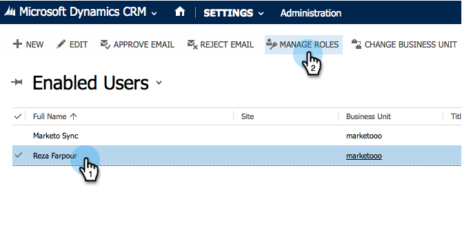

# Installera och konfigurera Marketo Sales Insight i Microsoft Dynamics 2013 {#install-and-configure-marketo-sales-insight-in-microsoft-dynamics}

Marketo Sales Insight är ett fantastiskt verktyg för att ge säljteamet ett&quot;fönster&quot; till alla data som marknadsföringsteamet har. Så här installerar och konfigurerar du den.

>[!PREREQUISITES]
>
>Slutför din [Marketo-Microsoft-integrering](http://docs.marketo.com/x/EIA2).
>
>[Hämta rätt ](http://docs.marketo.com/x/LoJo) lösning för din version av Microsoft Dynamics CRM.

## Importera lösning {#import-solution}

OK, nu är det dags att importera Marketo Sales Insight-lösningen till Microsoft Dynamics.

1. Under **Microsoft Dynamics CRM** klickar du på **Inställningar**.

   

1. Under **Inställningar** klickar du på **Anpassningar**.

   

1. Klicka på **Lösningar**.

   

   >[!NOTE]
   >
   >**Påminnelse**
   >
   >
   >Du bör redan ha installerat och konfigurerat Marketo innan du går vidare

1. Klicka på **Importera**.

   

1. Klicka på **Bläddra** i det nya fönstret.

   

1. Hitta och välj den lösning du laddat ned ovan.

   

1. Klicka på **Nästa**.

   

1. Lösningen överförs. Du kan visa paketinnehållet om du vill. Klicka på **Nästa**.

   

1. Se till att du inte markerar rutan och klicka på **Importera**.

   

1. Hämta loggfilen kostnadsfritt. Klicka på **Stäng**.

   

1. Häftig! Du borde se lösningen nu. Uppdatera skärmen om den inte finns där.

   

## Connect Marketo och Sales Insight {#connect-marketo-and-sales-insight}

Låt oss knyta din Marketo-instans till Sales Insight i Dynamics.

>[!NOTE]
>
>Administratörsrättigheter krävs.

1. Logga in på Marketo och gå till avsnittet **Admin**.

   

1. Klicka på **Redigera API-konfiguration** under **Sales Insight**.

   

1. Kopiera **Marketo Host**, **API URL** och **API User Id** för användning i ett senare steg. Ange en **API-hemlig nyckel** och klicka på **SPARA**.

   >[!CAUTION]
   >
   >Använd inte ett et-tecken (&amp;) i API-hemlig nyckel.

   

   >[!NOTE]
   >
   >Följande fält måste synkroniseras med Marketo för *både Lead och Contact* för att Sales Insight ska fungera:
   >
   >    
   >    
   >    * Prioritet
   >    * Akut
   >    * Relativa poäng

   >    
   >    
   >Om något av dessa fält saknas visas ett felmeddelande i Marketo med namnet på de fält som saknas. Utför [den här proceduren](../../../../product-docs/marketo-sales-insight/msi-for-microsoft-dynamics/setting-up-and-using/required-fields-for-syncing-marketo-with-dynamics.md) för att åtgärda detta.

1. Gå tillbaka i Microsoft Dynamics till **Inställningar**.

   

1. Under **Inställningar** klickar du på **Marketo API Config**.

   

1. Klicka på **Nytt**.

   

1. Ange den information du tog från Marketo tidigare och klicka på **Spara**.

   

## Ange användaråtkomst {#set-user-access}

Slutligen kan du ge specifika användare tillgång till Marketo Sales Insight.

1. Gå till **Inställningar**.

   

1. Klicka på **Användare**.

   

1. Markera den eller de användare som du vill ge åtkomst till Sales Insight till och klicka på **Hantera roller**.

   

1. Välj rollen **Marketo Sales Insight** och klicka på **OK**.

   

   Och du borde vara klar! Slutligen, för att testa, loggar du in i Dynamics som en användare som har tillgång till Marketo Sales Insight och tittar på ett lead eller en kontakt.

   

Du har nu låst upp kraften i Marketo Sales Insight för ditt säljteam.

>[!MORELIKETHIS]
>
>[Stjärnor och flamma för lead-/kontaktposter](http://docs.marketo.com/x/BICMAg)

