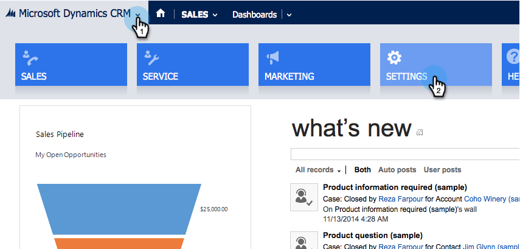

# Installera och konfigurera [!DNL Marketo Sales Insight] i [!DNL Microsoft Dynamics 2013] {#install-and-configure-marketo-sales-insight-in-microsoft-dynamics}

[!DNL Marketo Sales Insight] är ett fantastiskt verktyg för att ge säljteamet ett&quot;fönster&quot; till den stora mängd data marknadsföringsteamet har. Så här installerar och konfigurerar du den.

>[!PREREQUISITES]
>
>Komplettera integreringen mellan Marketo och Microsoft.
>
>[Hämta rätt lösning](/help/marketo/product-docs/marketo-sales-insight/msi-for-microsoft-dynamics/installing/download-the-marketo-sales-insight-solution-for-microsoft-dynamics.md) för din version av [!DNL Microsoft Dynamics] CRM.

## Importera lösning {#import-solution}

OK, nu är det dags att importera lösningen [!DNL Marketo Sales Insight] till [!DNL Microsoft Dynamics].

1. Klicka på **[!UICONTROL Microsoft Dynamics CRM]** under **[!UICONTROL Settings]**.

   

1. Klicka på **[!UICONTROL Settings]** under **[!UICONTROL Customizations]**.

   

1. Klicka på **[!UICONTROL Solutions]**.

   

   >[!NOTE]
   >
   >Du bör redan ha installerat och konfigurerat Marketo innan du går vidare

1. Klicka på **[!UICONTROL Import]**.

   

1. Klicka på **[!UICONTROL Browse]** i det nya fönstret.

   

1. Hitta och välj den lösning du laddat ned ovan.

   

1. Klicka på **[!UICONTROL Next]**.

   

1. Lösningen kommer att överföras. Du kan visa paketets innehåll om du vill. Klicka på **[!UICONTROL Next]**.

   

1. Se till att du inte markerar rutan och klicka på **[!UICONTROL Import]**.

   

1. Hämta loggfilen kostnadsfritt. Klicka på **[!UICONTROL Close]**.

   

1. Häftig! Du borde se lösningen nu. Uppdatera skärmen om den inte finns där.

   

## Connect Marketo och Sales Insight {#connect-marketo-and-sales-insight}

Låt oss binda din Marketo-instans till [!DNL Sales Insight] i [!DNL Dynamics].

>[!NOTE]
>
>Administratörsrättigheter krävs.

1. Logga in på Marketo och gå till avsnittet **[!UICONTROL Admin]**.

   

1. Klicka på **[!UICONTROL Sales Insight]** under avsnittet **[!UICONTROL Edit API Configuration]**.

   

1. Kopiera **[!UICONTROL Marketo Host]**, **[!UICONTROL API URL]** och **[!UICONTROL API User Id]** för användning i ett senare steg. Ange en **[!UICONTROL API Secret Key]** och klicka på **[!UICONTROL Save]**.

   >[!CAUTION]
   >
   >Använd inte ett et-tecken (&amp;) i API-hemlig nyckel.

   

   >[!NOTE]
   >
   >Följande fält måste synkroniseras med Marketo för _både lead och kontakt_ för att Sales Insight ska fungera:
   >
   >* Prioritet
   >* Akut
   >* Relativa poäng
   >
   >Om något av dessa fält saknas visas ett felmeddelande i Marketo med namnet på de saknade fälten. Utför [den här proceduren](/help/marketo/product-docs/marketo-sales-insight/msi-for-microsoft-dynamics/setting-up-and-using/required-fields-for-syncing-marketo-with-dynamics.md) om du vill åtgärda det.

1. Gå tillbaka om [!DNL Microsoft Dynamics], gå till **[!UICONTROL Settings]**.

   

1. Klicka på **[!UICONTROL Settings]** under **[!UICONTROL Marketo API Config]**.

   

1. Klicka på **[!UICONTROL New]**.

   

1. Ange informationen som du tog från Marketo tidigare och klicka på **[!UICONTROL Save]**.

   

## Ange användaråtkomst {#set-user-access}

Slutligen kan du ge specifika användare åtkomst till [!DNL Marketo Sales Insight].

1. Gå till **[!UICONTROL Settings]**.

   

1. Klicka på **[!UICONTROL Users]**.

   

1. Markera den eller de användare som du vill ge tillgång till Sales Insight och klicka på **[!UICONTROL Manage Roles]**.

   

1. Välj rollen **[!UICONTROL Marketo Sales Insight]** och klicka på **[!UICONTROL OK]**.

   

   Och du borde vara klar! Om du vill testa loggar du in på [!DNL Dynamics] som en användare som har åtkomst till [!DNL Marketo Sales Insight] och tittar på ett lead eller en kontakt.

   

Du har nu låst upp kraften hos [!DNL Marketo Sales Insight] för ditt säljteam.

>[!MORELIKETHIS]
>
>[Konfigurera stjärnor och flamma för lead-/kontaktposter](/help/marketo/product-docs/marketo-sales-insight/msi-for-microsoft-dynamics/setting-up-and-using/setting-up-stars-and-flames-for-lead-contact-records.md)
