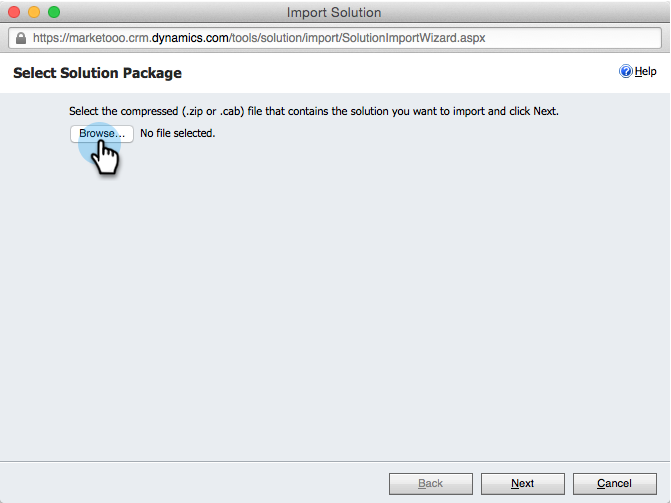

# Installera och konfigurera Marketo Sales Insight i Microsoft Dynamics 2013 {#install-and-configure-marketo-sales-insight-in-microsoft-dynamics}

Marketo Sales Insight är ett fantastiskt verktyg för att ge säljteamet ett&quot;fönster&quot; till alla data som marknadsföringsteamet har. Så här installerar och konfigurerar du den.

>[!PREREQUISITES]
>
>Komplettera integreringen mellan Marketo och Microsoft.
>
>[Ladda ned rätt lösning](/help/marketo/product-docs/marketo-sales-insight/msi-for-microsoft-dynamics/installing/download-the-marketo-sales-insight-solution-for-microsoft-dynamics.md) för din version av Microsoft Dynamics CRM.

## Importera lösning {#import-solution}

OK, nu är det dags att importera Marketo Sales Insight-lösningen till Microsoft Dynamics.

1. Under **Microsoft Dynamics CRM** klicka **Inställningar**.

   

1. Under **Inställningar**, klicka **Anpassningar**.

   

1. Klicka **Lösningar**.

   

   >[!NOTE]
   >
   >Du bör redan ha installerat och konfigurerat Marketo innan du går vidare

1. Klicka **Importera**.

   

1. Klicka på **Bläddra**.

   

1. Hitta och välj den lösning du laddat ned ovan.

   

1. Klicka **Nästa**.

   

1. Lösningen överförs. Du kan visa paketinnehållet om du vill. Klicka **Nästa**.

   

1. Se till att du inte markerar rutan och klicka **Importera**.

   

1. Hämta loggfilen kostnadsfritt. Klicka **Stäng**.

   

1. Häftig! Du borde se lösningen nu. Uppdatera skärmen om den inte finns där.

   

## Connect Marketo och Sales Insight {#connect-marketo-and-sales-insight}

Låt oss binda din Marketo-instans till Sales Insight i Dynamics.

>[!NOTE]
>
>Administratörsrättigheter krävs.

1. Logga in på Marketo och gå till **Administratör** -avsnitt.

   

1. Under **Försäljningsinsikter** avsnittsklicka **Redigera API-konfiguration**.

   

1. Kopiera **Marketo Host**, **API-URL** och **API-användar-ID** för användning i ett senare steg. Ange en **API-hemlig nyckel** efter eget val och klicka **Spara**.

   >[!CAUTION]
   >
   >Använd inte ett et-tecken (&amp;) i API-hemlig nyckel.

   

   >[!NOTE]
   >
   >Följande fält måste synkroniseras med Marketo för _både lead och kontakt_ för Sales Insight att arbeta:
   >
   >* Prioritet
   >* Akut
   >* Relativa poäng

   >
   >Om något av dessa fält saknas visas ett felmeddelande i Marketo med namnet på de saknade fälten. Åtgärda problemet genom att utföra [detta förfarande](/help/marketo/product-docs/marketo-sales-insight/msi-for-microsoft-dynamics/setting-up-and-using/required-fields-for-syncing-marketo-with-dynamics.md).

1. Tillbaka i Microsoft Dynamics, gå till **Inställningar**.

   

1. Under **Inställningar**, klicka **Marketo API Config**.

   

1. Klicka **Nytt**.

   

1. Ange den information du tog från Marketo tidigare och klicka på **Spara**.

   

## Ange användaråtkomst {#set-user-access}

Slutligen kan du ge specifika användare tillgång till Marketo Sales Insight.

1. Gå till **Inställningar**.

   

1. Klicka **Användare**.

   

1. Välj den eller de användare som du vill ge tillgång till Sales Insight till och klicka på **Hantera roller**.

   

1. Välj **Marketo Sales Insight** roll och klicka **OK**.

   

   Och du borde vara klar! Slutligen, för att testa, logga in i Dynamics som en användare som har tillgång till Marketo Sales Insight och titta på en lead eller kontakt.

   

Nu har du låst upp styrkan hos Marketo Sales Insight för ditt säljteam.

>[!MORELIKETHIS]
>
>[Stjärnor och flamma för lead-/kontaktposter](/help/marketo/product-docs/marketo-sales-insight/msi-for-microsoft-dynamics/setting-up-and-using/setting-up-stars-and-flames-for-lead-contact-records.md)
