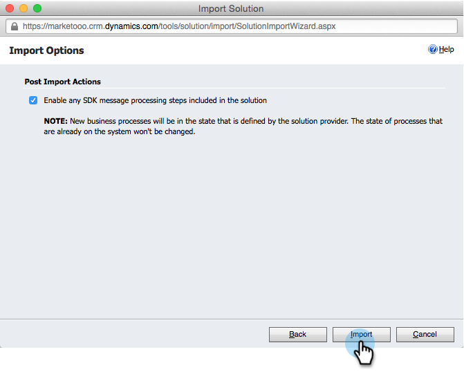

# Installera och konfigurera [!DNL Marketo Sales Insight] i [!DNL Microsoft Dynamics 365] {#install-and-configure-marketo-sales-insight-in-microsoft-dynamics}

[!DNL Marketo Sales Insight] är ett fantastiskt verktyg för att ge säljteamet ett&quot;fönster&quot; till den stora mängd data som marknadsföringsteamet har. Så här installerar och konfigurerar du.

>[!PREREQUISITES]
>
>Komplettera integreringen mellan Marketo och Microsoft.
>
>[Hämta rätt lösning](/help/marketo/product-docs/marketo-sales-insight/msi-for-microsoft-dynamics/installing/download-the-marketo-sales-insight-solution-for-microsoft-dynamics.md) för din version av [!DNL Microsoft Dynamics CRM].

## Importera lösning {#import-solution}

1. Logga in på [[!DNL Microsoft Office 365]](https://login.microsoftonline.com/).

   

1. Klicka på menyn  och välj **CRM**.

   

1. Klicka på menyn . I listrutan väljer du **[!DNL Settings]** och sedan **[!DNL Solutions]**.

   

   >[!NOTE]
   >
   >Du bör redan ha [installerat och konfigurerat Marketo-lösningen](/help/marketo/product-docs/crm-sync/microsoft-dynamics-sync/sync-setup/microsoft-dynamics-365-with-ropc-connection/step-1-of-4-install.md) innan du går vidare.

1. Klicka på **[!UICONTROL Import]**.

   

1. Klicka på **[!UICONTROL Browse]** i det nya fönstret. Välj den [Marketo Sales Insight-lösning som du hämtade i steg 1](#msi). Klicka på **[!UICONTROL Next]**.

   

1. Lösningen kommer att överföras. Du kan visa paketets innehåll om du vill. Klicka på **[!UICONTROL Next]**.

   

1. Lämna rutan **[!UICONTROL checked]** och klicka på **[!UICONTROL Import]**.

   

1. Hämta loggfilen kostnadsfritt. Klicka på **[!UICONTROL Close]**.

   

1. Häftig! Du borde se lösningen nu. Uppdatera skärmen om den inte finns där.

   

1. Klicka på **[!UICONTROL Publish All Customizations]**.

   

## Anslut Marketo och [!DNL Sales Insight] {#connect-marketo-and-sales-insight}

Låt oss binda din Marketo-instans till [!DNL Sales Insight] i [!DNL Dynamics]. Så här:

>[!NOTE]
>
>**Administratörsbehörigheter krävs**

1. Logga in på Marketo och gå till avsnittet **[!UICONTROL Admin]**.

   

1. Klicka på **[!UICONTROL Sales Insight]** Redigera API-konfiguration **under avsnittet**.

   

1. Kopiera **[!UICONTROL Marketo Host]**, **[!UICONTROL API URL]** och **[!UICONTROL API User Id]** för användning i ett senare steg. Ange en **[!UICONTROL API Secret Key]** och klicka på **[!UICONTROL Save]**.

   >[!CAUTION]
   >
   >Använd inte ett et-tecken (&amp;) i API-hemlig nyckel.

   

   >[!NOTE]
   >
   >Följande fält måste synkroniseras med Marketo för att _både Lead och Contact_ ska fungera: [!DNL Sales Insight]
   >
   > * Prioritet
   > * Akut
   > * Relativa poäng
   >
   >Om något av dessa fält saknas visas ett felmeddelande i Marketo med namnet på de saknade fälten. Utför [den här proceduren](/help/marketo/product-docs/marketo-sales-insight/msi-for-microsoft-dynamics/setting-up-and-using/required-fields-for-syncing-marketo-with-dynamics.md) om du vill åtgärda det.

1. Gå tillbaka i [!DNL Microsoft Dynamics], klicka på ikonen  intill [!UICONTROL Settings] och välj sedan **[!UICONTROL Marketo API Config]** i listrutan.

   

1. Klicka på **[!UICONTROL Default Configuration]**.

   

1. Ange den information som du kopierade från Marketo tidigare.

   

1. Klicka på ikonen  längst ned till höger för att spara ändringarna.

## Ange användaråtkomst {#set-user-access}

Du måste ge användarna behörighet att använda [!DNL Sales Insight].

1. Klicka på menyn . I listrutan väljer du **[!UICONTROL Settings]** och sedan **[!UICONTROL Security]**.

   

1. Klicka på **[!UICONTROL Users]**.

   

1. Markera de användare som du vill ge åtkomst till [!DNL Sales Insight] och klicka på **[!UICONTROL Manage Roles]**.

   

1. Välj rollen **[!UICONTROL Marketo Sales Insight]** och klicka på **[!UICONTROL OK]**.

   

   Och du borde vara klar! Om du vill testa loggar du in på [!DNL Dynamics] som en användare som har åtkomst till [!DNL Marketo Sales Insight] och tittar på ett lead eller en kontakt.

   

Du har nu låst upp kraften hos [!DNL Marketo Sales Insight] för ditt säljteam.

>[!MORELIKETHIS]
>
>[Konfigurera stjärnor och flamma för lead-/kontaktposter](/help/marketo/product-docs/marketo-sales-insight/msi-for-microsoft-dynamics/setting-up-and-using/setting-up-stars-and-flames-for-lead-contact-records.md)
