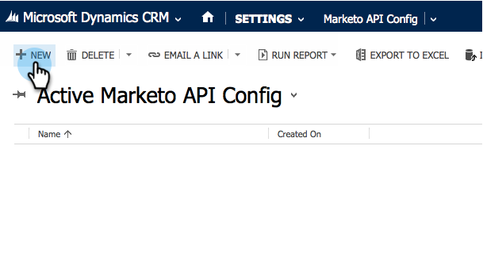

# Installera och konfigurera Marketo Sales Insight i Microsoft Dynamics Online {#install-and-configure-marketo-sales-insight-in-microsoft-dynamics-online}

Marketo Sales Insight är ett fantastiskt verktyg för att ge säljteamet ett&quot;fönster&quot; till det stora datamängder som marknadsföringsteamet har. Så här installerar och konfigurerar du den i Microsoft Dynamics Online.

>[!NOTE]
>
>**Förutsättningar**
>
>Slutför er [Marketo-Microsoft-integrering](http://docs.marketo.com/x/E4A2).
>
>[Hämta rätt lösning](http://docs.marketo.com/x/LoJo) för din version av Microsoft Dynamics CRM.

## Importera lösning {#import-solution}

>[!NOTE]
>
>Om du använder det enhetliga gränssnittet, innan steg 1 nedan, klickar du på ikonen Inställningar i det övre högra hörnet och väljer **Avancerade inställningar**.

1. Klicka på **Inställningar** under Microsoft Dynamics CRM.

   

1. Klicka på **Anpassningar** under INSTÄLLNINGAR.

   

1. Klicka på **Lösningar**.

   

   >[!NOTE]
   >
   >**Påminnelse**
   >
   >
   >Du bör redan ha installerat och konfigurerat Marketo-lösningen innan du går vidare.

1. Klicka på **Importera**.

   

1. Klicka på **Bläddra** i det nya fönstret.

   

1. Hitta och installera den lösning du just laddat ned på datorn.
1. Klicka på **Nästa**.

   

1. Lösningen överförs. Du kan visa paketinnehållet om du vill. Klicka på **Nästa**.

   

1. Se till att du inte markerar rutan och klicka på **Importera**.

   

1. Hämta loggfilen utan kostnad och klicka sedan på **Stäng**.

   

1. Häftig! Du borde se lösningen nu. Uppdatera skärmen om den inte finns där.

   

1. Klicka på **Publicera anpassning**.

   >[!NOTE]
   >
   >Se till att aktivera den globala MS Dynamics-synkroniseringen.

## Connect Marketo och Sales Insight {#connect-marketo-and-sales-insight}

Låt oss knyta din Marketo-instans till Sales Insight i Dynamics. Så här:

>[!NOTE]
>
>**Administratörsbehörigheter krävs**

1. Logga in på Marketo och gå till **Admin **sektionen.

   

1. Klicka på **Redigera API-konfiguration** under Sales Insight.

   

1. Kopiera **Marketo Host**, **API URL** och **API User Id** för användning i ett senare steg. Ange en API-hemlig nyckel och klicka på **Spara**.

   >[!CAUTION]
   >
   >Använd inte ett et-tecken (&amp;) i API-hemlig nyckel.

   

   >[!NOTE]
   >
   >Följande fält måste synkroniseras med Marketo för att *både Lead och Contact* for Sales Insight ska fungera:
   >
   >    
   >    
   >    * Prioritet
   >    * Akut
   >    * Relativa poäng

   >    
   >    
   >Om något av dessa fält saknas visas ett felmeddelande i Marketo med namnet på de fält som saknas. Utför [den här proceduren](../../../../product-docs/marketo-sales-insight/msi-for-microsoft-dynamics/setting-up-and-using/required-fields-for-syncing-marketo-with-dynamics.md)för att åtgärda detta.

1. Gå tillbaka till Microsoft Dynamics, gå till **Inställningar**.

   

1. Under **Inställningar** klickar du på **Marketo API Config**.

   

1. Klicka på **Nytt**.

   

1. Ange den information du tog från Marketo tidigare och klicka på **Spara**.

   

## Aktivera synkronisering {#enable-sync}

1. I Marketo klickar du på **Admin**.

   

1. Välj **Microsoft Dynamics** under Integrering.

   

1. Klicka på **Aktivera synkronisering**.

   

1. Klicka på **Redigera** bredvid Fältsynkroniseringsinformation.

   

1. Detta väljer *automatiskt* MSI-fält som tidigare har inaktiverats (Urnummer, Relativ poäng och Prioritet). Klicka bara på **Spara** för att börja synkronisera data.

   

## Ange användaråtkomst {#set-user-access}

Slutligen måste du ge specifika användare tillgång till Marketo Sales Insight.

1. Gå till **Inställningar**.

   

1. Gå till **Säkerhet**.

   

1. Klicka på **Användare**.

   

1. Markera de användare som du vill ge tillgång till Sales Insight och klicka på **Hantera roller**.

   

1. Markera Marketo Sales Insight-rollen och klicka på **OK**.

   

   Och du borde vara klar! Slutligen, för att testa, logga in i Dynamics som en användare som har tillgång till Marketo Sales Insight och titta på en lead eller kontakt.

   

>[!NOTE]
>
>**Relaterade artiklar**
>
>[Stjärnor och flamma för lead-/kontaktposter](http://docs.marketo.com/x/BICMAg)

